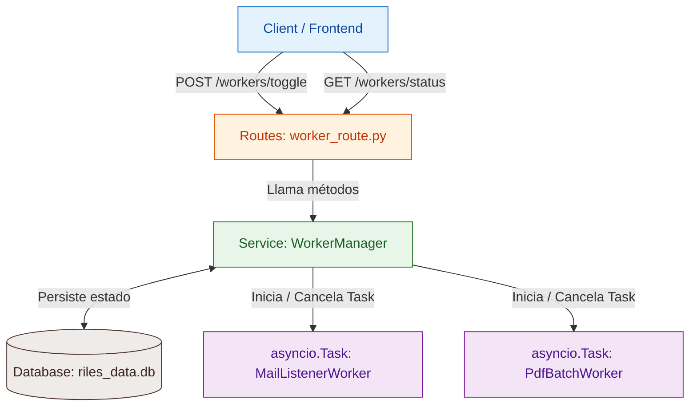

Para crear un sistema de **Workers dinamicos** (que se puedan activar, pausar o deshabilitar mediante endpoints y persistan su estado en la base de datos), la mejor estrategia en Python/FastAPI es combinar **`asyncio` (para las tareas en segundo plano)** con un **`WorkerManager` (orquestador tipo Service)** y un almacenamiento de estado.

A continuacion tienes el diseño completo y funcional adaptado a la arquitectura modular de tu proyecto.

---

## 1. Esquema de Arquitectura del Sistema



---

## 2. Definicion de Metadatos (`metadata.json`)

Cada worker en su respectiva carpeta dentro de `background_processes/` llevara su archivo de configuracion:

```json
{
  "id": "mail_listener",
  "name": "Lector de Correo Outlook",
  "description": "Descarga y procesa PDFs adjuntos de la casilla de correo cada 300s.",
  "default_interval_seconds": 300,
  "enabled": false
}

```

---

## 3. Implementación del Worker (`worker.py`)

Un worker debe ser un bucle asincrono que respete la cancelacion limpia (`asyncio.CancelledError`):

```python
# background_processes/mail_listener/worker.py
import asyncio
from datetime import datetime

async def run_mail_listener(interval_seconds: int = 300):
  """
  Lógica principal del Worker. Se ejecuta en bucle continuo
  hasta que la asyncio.Task es cancelada.
  """
  print(f"[{datetime.now()}] Worker 'mail_listener' INICIADO.")
  try:
    while True:
      # --- AQUI VA TU LOGICA DE PROCESAMIENTO ---
      print(f"[{datetime.now()}] 'mail_listener' ejecutando revision de correo...")
      # Simulación o llamada a process_mailbox()
      
      # Espera asíncrona que permite que la tarea sea cancelada en cualquier momento
      await asyncio.sleep(interval_seconds)

  except asyncio.CancelledError:
    print(f"[{datetime.now()}] Worker 'mail_listener' DETENIDO correctamente.")
    raise

```

---

## 4. El Orquestador Central (`WorkerManager`)

Este componente se encarga de:

1. Mantener en memoria las referencias de las `asyncio.Task` activas.
2. Levantar o cancelar tareas segun la instruccion.
3. Consultar y actualizar la base de datos (`riles_data.db`).

```python
# background_processes/manager.py
import asyncio
import sqlite3
from typing import Dict, List, Optional
from datetime import datetime

# Importar los runners de tus workers
from background_processes.mail_listener.worker import run_mail_listener

DB_PATH = "riles_data.db"

class WorkerManager:
  def __init__(self):
    # Diccionario para almacenar las referencias de las tareas activas en memoria
    # Estructura: {"worker_id": asyncio.Task}
    self.active_tasks: Dict[str, asyncio.Task] = {}

    # Mapeo de IDs a sus funciones ejecutables
    self.registry = {
      "mail_listener": run_mail_listener
    }

  def _update_db_status(self, worker_id: str, is_active: bool, user_id: Optional[int] = None):
    """Actualiza el estado del worker en SQLite."""
    conn = sqlite3.connect(DB_PATH)
    cursor = conn.cursor()
    cursor.execute("""
      CREATE TABLE IF NOT EXISTS worker_status (
        worker_id TEXT PRIMARY KEY,
        is_active INTEGER,
        last_toggle DATETIME,
        updated_by_user INTEGER
      )
    """)
    cursor.execute("""
      INSERT INTO worker_status (worker_id, is_active, last_toggle, updated_by_user)
      VALUES (?, ?, ?, ?)
      ON CONFLICT(worker_id) DO UPDATE SET
        is_active = excluded.is_active,
        last_toggle = excluded.last_toggle,
        updated_by_user = excluded.updated_by_user
    """, (worker_id, 1 if is_active else 0, datetime.now(), user_id))
    conn.commit()
    conn.close()

  async def start_worker(self, worker_id: str, user_id: Optional[int] = None) -> bool:
    """Habilita y arranca un worker si no está corriendo."""
    if worker_id in self.active_tasks and not self.active_tasks[worker_id].done():
      return False  # Ya está corriendo

    if worker_id not in self.registry:
      raise ValueError(f"Worker '{worker_id}' no está registrado.")

    # Iniciar la tarea asíncrona en el Event Loop
    worker_fn = self.registry[worker_id]
    task = asyncio.create_task(worker_fn())
    self.active_tasks[worker_id] = task

    # Registrar en base de datos
    self._update_db_status(worker_id, is_active=True, user_id=user_id)
    return True

  async def stop_worker(self, worker_id: str, user_id: Optional[int] = None) -> bool:
    """Deshabilita y detiene un worker en ejecución."""
    if worker_id not in self.active_tasks:
      return False  # No estaba corriendo

    task = self.active_tasks[worker_id]
    task.cancel()  # Cancela la asyncio.Task

    try:
      await task  # Espera a que la tarea procese el CancelledError
    except asyncio.CancelledError:
      pass

    del self.active_tasks[worker_id]
    self._update_db_status(worker_id, is_active=False, user_id=user_id)
    return True

  def get_status(self) -> List[dict]:
    """Retorna el estado de todos los workers."""
    conn = sqlite3.connect(DB_PATH)
    cursor = conn.cursor()
    cursor.execute("SELECT worker_id, is_active, last_toggle, updated_by_user FROM worker_status")
    rows = cursor.fetchall()
    conn.close()

    status_list = []
    for w_id in self.registry.keys():
      is_running = w_id in self.active_tasks and not self.active_tasks[w_id].done()
      status_list.append({
        "worker_id": w_id,
        "is_running": is_running,
        "db_active": next((bool(r[1]) for r in rows if r[0] == w_id), False)
      })
    return status_list

  async def restore_workers_from_db(self):
    """
    Al arrancar el servidor (startup), restaura el estado de los
    workers que estaban activos previamente.
    """
    conn = sqlite3.connect(DB_PATH)
    cursor = conn.cursor()
    try:
      cursor.execute("SELECT worker_id FROM worker_status WHERE is_active = 1")
      active_workers = cursor.fetchall()
      for (w_id,) in active_workers:
        if w_id in self.registry:
          await self.start_worker(w_id)
          print(f"-> Worker '{w_id}' restaurado automáticamente desde la DB.")
    except sqlite3.OperationalError:
      pass  # La tabla aún no existe
    finally:
      conn.close()

# Instancia global del servicio manager
worker_manager = WorkerManager()

```

---

## 5. Endpoints de Control (`x.controller.ts` / Route)

```python
# routes/background_processes/processes_route.py
from fastapi import APIRouter, HTTPException
from pydantic import BaseModel
from typing import Optional
from background_processes.manager import worker_manager

router = APIRouter(prefix="/workers", tags=["Workers Manager"])

class ToggleWorkerDTO(BaseModel):
  worker_id: str
  enable: bool
  user_id: Optional[int] = None

@router.get("/status")
async def get_workers_status():
  """Consulta el estado de todos los workers registrados."""
  return {"workers": worker_manager.get_status()}

@router.post("/toggle")
async def toggle_worker(data: ToggleWorkerDTO):
  """Habilita o deshabilita un worker específico."""
  try:
    if data.enable:
      success = await worker_manager.start_worker(data.worker_id, user_id=data.user_id)
      message = "Worker iniciado exitosamente." if success else "El worker ya estaba corriendo."
    else:
      success = await worker_manager.stop_worker(data.worker_id, user_id=data.user_id)
      message = "Worker detenido exitosamente." if success else "El worker no estaba activo."

    return {"status": "ok", "message": message, "worker_id": data.worker_id}
  except ValueError as err:
    raise HTTPException(status_code=400, detail=str(err))

```

---

## 6. Integración en el Servidor (`main.py`)

Al iniciar la aplicación, usas el evento `lifespan` para restaurar los workers que el usuario dejó encendidos en su última sesión:

```python
# main.py
from fastapi import FastAPI
from contextlib import asynccontextmanager
from background_processes.manager import worker_manager
from routes.background_processes.processes_route import router as workers_router

@asynccontextmanager
async def lifespan(app: FastAPI):
  # STARTUP: Restaurar tareas activas según la base de datos
  await worker_manager.restore_workers_from_db()
  yield
  # SHUTDOWN: Detener todas las tareas de forma limpia al apagar el servidor
  for w_id in list(worker_manager.active_tasks.keys()):
    await worker_manager.stop_worker(w_id)

app = FastAPI(title="Sistema de Workers", lifespan=lifespan)
app.include_router(workers_router, prefix="/api/v1")

```
---

### ¿Cómo probarlo?

1. **Consultar estado:**
`GET http://localhost:8000/api/v1/workers/status`
2. **Activar un Worker:**
`POST http://localhost:8000/api/v1/workers/toggle`
```json
{
  "worker_id": "mail_listener",
  "enable": true,
  "user_id": 10
}

```


3. **Desactivar un Worker:**
`POST http://localhost:8000/api/v1/workers/toggle`
```json
{
  "worker_id": "mail_listener",
  "enable": false,
  "user_id": 10
}

```