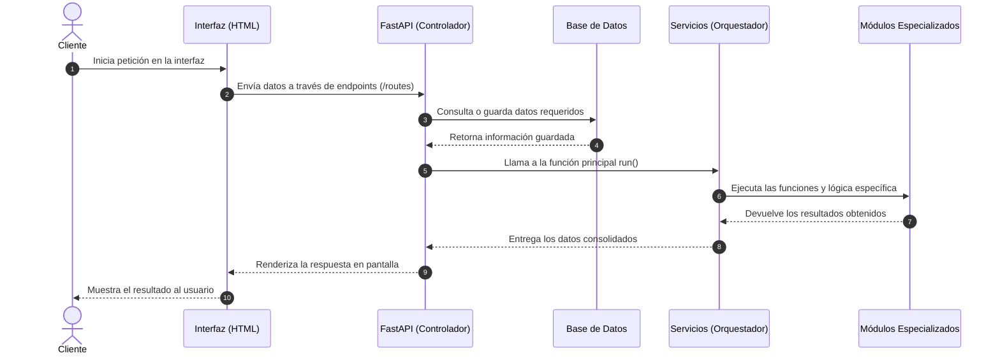
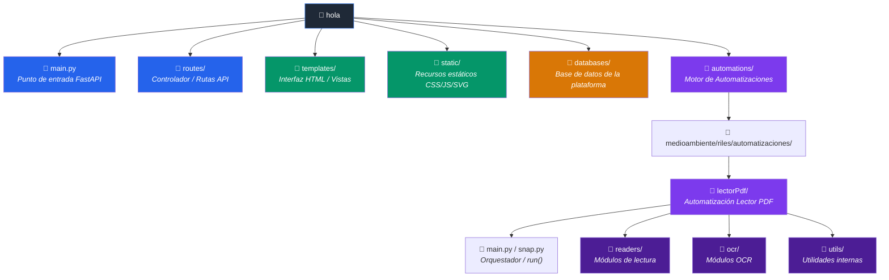

# Documentación del Proyecto: Arquitectura General

Este repositorio contiene una plataforma extensible basada en **FastAPI** diseñada para alojar y ejecutar diversos tipos de **automatizaciones y proyectos**. Aunque actualmente cuenta con una automatización activa (Lector de PDF para informes ambientales RILES), la arquitectura está concebida para integrar cualquier tipo de desarrollo o herramienta.

---

## 🏗️ Estructura General de un Plugin / Automatización

La plataforma sigue un diseño modular. Cualquier nuevo proyecto o automatización que se incorpore se estructura en torno a las siguientes capas:

* **Interfaz:** Vistas HTML e interacción con el usuario en el navegador.
* **Controlador:** Endpoints HTTP que reciben peticiones y gestionan la entrada/salida de datos.
* **Servicios:** Clases u orquestadores encargados de la lógica central del proceso.
* **Módulos:** Funciones, utilidades y bibliotecas específicas de la automatización.
* **Base de Datos (Opcional):** Capa de persistencia para guardar registros, trazabilidad o resultados.

---

## 🔄 Diagrama de Secuencia de la Arquitectura



---

## 📁 Diagrama de Estructura de Carpetas



---

## 🧩 Componentes del Sistema

### 1. Servidor y Rutas (`main.py` y `routes/`)

* **`main.py`:** Punto de entrada del sistema. Inicializa FastAPI, gestiona recursos estáticos y conecta las diferentes rutas de la aplicación.
* **`routes/`:** Controladores organizados por categoría (ej. `routes/medioambiente/`). Exponen los endpoints para interactuar con las automatizaciones.

### 2. Capa de Interfaz (`templates/` y `static/`)

* **`templates/`:** Contiene las vistas HTML organizadas por sección o categoría.
* **`static/`:** Almacena los estilos CSS, scripts JavaScript, íconos SVG y recursos globales.

### 3. Base de Datos (`databases/`)

* Guarda información de soporte, catálogos o históricos de ejecuciones utilizadas por las automatizaciones.

### 4. Motor de Automatizaciones (`automations/`)

Espacio reservado para el desarrollo del código base de los proyectos. Cada automatización se aloja dentro de su categoría correspondiente (ej. `automations/medioambiente/...`). Aquí residen la lógica de negocio, scripts, parsers o modelos de procesamiento.

---

## 🚀 Paso a Paso: ¿Cómo Crear una Nueva Automatización?

Para incorporar cualquier nuevo proyecto o herramienta a la plataforma, se debe seguir este flujo estándar:

```
┌─────────────────────────┐
│ 1. Crear Automatización │  --> Desarrollar la lógica en automations/<categoria>/
└───────────┬─────────────┘
            ▼
┌─────────────────────────┐
│ 2. Crear Endpoints      │  --> Exponer la funcionalidad en routes/
└───────────┬─────────────┘
            ▼
┌─────────────────────────┐
│ 3. Crear Interfaz       │  --> Diseñar la plantilla HTML en templates/
└───────────┬─────────────┘
            ▼
┌─────────────────────────┐
│ 4. Registrar en Home    │  --> Agregar el acceso en la categoría de la página principal
└─────────────────────────┘

```

1. **Crear la Automatización:** Desarrolla el código core dentro del directorio `automations/` asignando una categoría (ej. `sostenibilidad`, `medioambiente`, `generic`). Asegúrate de exponer una función o clase orquestadora principal (como `run()`).
2. **Crear los Endpoints:** En la carpeta `routes/`, crea o actualiza el archivo de rutas correspondiente para conectar la petición web con la ejecución de tu automatización.
3. **Crear la Interfaz:** Genera la vista HTML dentro de `templates/` para interactuar con el nuevo flujo (formularios, carga de archivos, paneles de control).
4. **Agregar a la Página Principal:** Vincula la nueva automatización agregando su enlace e interfaz en la vista principal, dentro de la categoría que le corresponda. *(Actualmente, la única automatización activa es la de Lectura de PDF, ubicada en la categoría de Medioambiente).*
