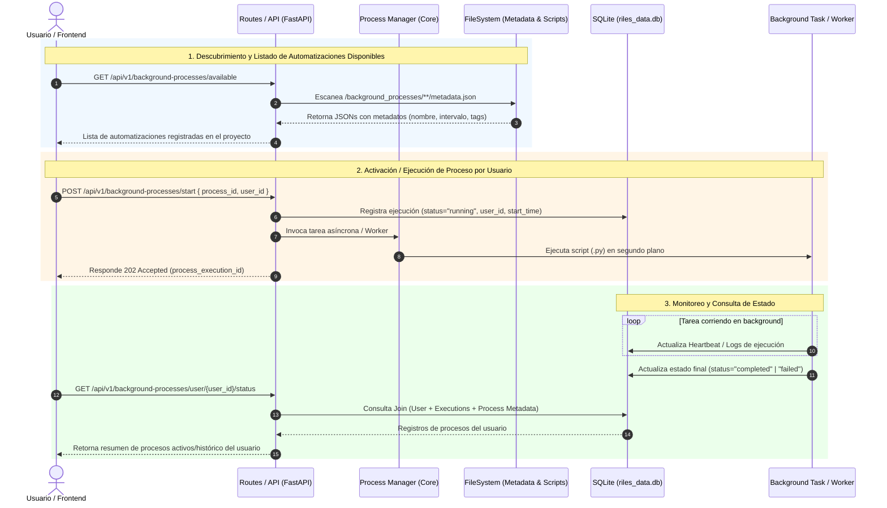

Para estructurar un sistema de gestión de procesos en segundo plano (*background processes / workers*) que permita **descubrir automatizaciones**, **registrar metadatos** y **consultar el estado de ejecución por usuario vía API**, el enfoque modular más limpio es separar los procesos en una carpeta dedicada `background_processes/` y centralizar la gestión de estado a través de una base de datos SQLite y endpoints en `routes/`.

A continuación tienes la propuesta arquitectónica mediante un **diagrama de flujo/secuencia y componentes en Mermaid**, junto con la estructura de archivos sugerida.

---

### Diagrama de Arquitectura y Flujo de Gestión de Procesos



---

### Reestructuración Propuesta del Proyecto

Para implementar este diseño, agregamos la carpeta `background_processes/` separada de `automations/` y un módulo de rutas `routes/background_processes.py`:

```text
📁 hola/
 ├── 📄 main.py
 ├── 📄 start.py
 ├── 📄 riles_data.db                 <-- Base de datos (Tablas: users, process_logs, user_processes)
 │
 ├── 📁 background_processes/         <-- NUEVA: Carpeta exclusiva para tareas/workers en background
 │    ├── 📄 __init__.py
 │    ├── 📄 manager.py               <-- Motor para descubrir, lanzar y monitorear tareas
 │    │
 │    ├── 📁 mail_listener/           <-- Proceso 1: Ej. Lector de Outlook en background
 │    │    ├── 📄 metadata.json       <-- Metadatos de la automatización
 │    │    └── 📄 worker.py          <-- Bucle principal del proceso
 │    │
 │    └── 📁 pdf_batch_processor/     <-- Proceso 2: Ej. Procesador masivo de PDFs Riles
 │         ├── 📄 metadata.json
 │         └── 📄 worker.py
 │
 ├── 📁 automations/                  <-- Automatizaciones síncronas / scripts bajo demanda
 │    └── 📁 medioambiente/
 │         └── 📁 riles/
 │              └── 📁 lectorPdf/
 │
 ├── 📁 routes/
 │    ├── 📁 background_processes/    <-- NUEVA: Endpoint para consultar y controlar procesos
 │    │    ├── 📄 __init__.py
 │    │    └── 📄 processes_route.py  <-- GET /available, GET /user/{id}/status, POST /start
 │    │
 │    └── 📁 medioambiente/
 │
 └── 📁 templates/
      └── 📄 background_dashboard.html <-- Panel para visualizar procesos en ejecución por usuario

```

---

### Ejemplo de Estructura de Archivos Clave

#### 1. Metadatos del Proceso (`background_processes/mail_listener/metadata.json`)

```json
{
  "id": "mail_listener_riles",
  "name": "Lector de Correo Outlook Riles",
  "description": "Monitorea la casilla de correo cada 300 segundos descargando PDFs adjuntos.",
  "category": "medioambiente/riles",
  "version": "1.0.0",
  "entry_point": "worker.py",
  "default_interval_seconds": 300,
  "requires_auth": true
}

```

#### 2. Esquema de Base de Datos SQLite (`riles_data.db`)

* **`user_active_processes`**: Vincula qué usuario activó qué proceso y su estado actual.
* `id` (PK)
* `user_id` (FK)
* `process_id` (string, ej: `"mail_listener_riles"`)
* `status` (`"RUNNING"`, `"STOPPED"`, `"FAILED"`, `"COMPLETED"`)
* `started_at` (datetime)
* `last_heartbeat` (datetime)
* `execution_logs` (text)


---

### Ventajas de este Diseño

1. **Desacoplamiento total:** La carpeta `automations/` se mantiene para scripts de procesamiento directo (como la lectura de PDFs), mientras que `background_processes/` gestiona únicamente la orquestación y re-ejecución continua.
2. **Escalabilidad:** Al consultar el endpoint `GET /api/v1/background-processes/available`, la aplicación lee dinámicamente las carpetas dentro de `background_processes/` sin necesidad de hardcodear nuevas automatizaciones en el código del servidor.  