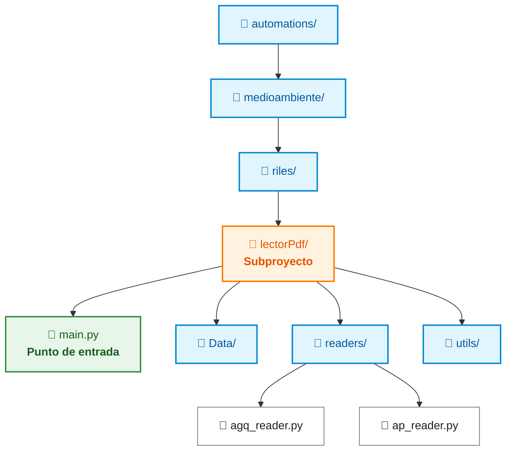

# Arquitectura de Motor de Automatizaciones (Plugin Architecture)

Esta arquitectura está diseñada para un backend orquestador: el backend descubre, ubica y dispara subproyectos dinámicamente, mientras que cada automatización es un paquete independiente autoconsciente de sus propios recursos (archivos CSV, PDFs de prueba, configuraciones JSON, etc.).


## 1. Autoubicación de Subproyectos

Cada automatización dentro de `automations/` debe resolver sus rutas internas usando `pathlib.Path(__file__)`. Esto garantiza que los archivos se encuentren correctamente independientemente del directorio de trabajo (`pwd`) desde el cual el backend ejecute el proceso.

```python
# automations/medioambiente/riles/lectorPdf/config.py
from pathlib import Path

# Ruta raíz exclusiva de ESTA automatización
BASE_DIR = Path(__file__).resolve().parent

# Rutas internas relativas
DATA_DIR = BASE_DIR / "Data"
TEST_PDF_DIR = BASE_DIR / "test pdf"
KEYWORDS_FILE = BASE_DIR / "readers" / "dataKeywords.json"

```


## 2. Contrato Estándar para la Automatización

Para que el backend pueda ejecutar cualquier proyecto sin importar su jerarquía en el árbol de carpetas, establece una convención: cada subproyecto expone un punto de entrada estándar (`main.py`) con una función `run()`.

### Estructura de carpetas recomendada

```plaintext
automations/
└── medioambiente/
  └── riles/
    └── lectorPdf/            <-- Subproyecto
      ├── main.py             <-- Punto de entrada estandarizado
      ├── Data/
      ├── readers/            
      │   ├── agq_reader.py
      │   └── ap_reader.py
      └── utils/
```



### Punto de entrada (`lectorPdf/main.py`)

```python
import sys
from pathlib import Path

# Registra la raíz del subproyecto en sys.path para resolver imports internos
BASE_DIR = Path(__file__).resolve().parent
if str(BASE_DIR) not in sys.path:
  sys.path.insert(0, str(BASE_DIR))

from readers.ap_reader import procesar_ap

def run(payload=None):
  """
  Punto de entrada invocado por el backend.
  """
  print(f"Ejecutando lectorPdf desde: {BASE_DIR}")
  
  # Lógica principal del script
  # ...
  
  return {"status": "success", "data": {}}

```


## 3. Carga y Ejecución Dinámica desde el Backend

El backend no importa estáticamente los submódulos. Recibe la ruta relativa de la automatización a ejecutar y la carga bajo demanda utilizando `importlib`.

```python
# routes/medioambiente/medioambiente.py (o ejecutor central)
import importlib.util
from pathlib import Path

def ejecutar_automatizacion(ruta_relativa_proyecto: str, payload: dict = None):
  """
  Carga y ejecuta dinámicamente cualquier automatización.
  Ejemplo de ruta_relativa_proyecto: "medioambiente/riles/lectorPdf"
  """
  backend_root = Path(__file__).resolve().parent.parent.parent
  proyecto_dir = backend_root / "automations" / ruta_relativa_proyecto
  entry_point = proyecto_dir / "main.py"

  if not entry_point.exists():
    raise FileNotFoundError(f"No se encontró el punto de entrada en {entry_point}")

  # Carga dinámica del módulo Python
  spec = importlib.util.spec_from_file_location("modulo_automatizacion", entry_point)
  modulo = importlib.util.module_from_spec(spec)
  spec.loader.exec_module(modulo)

  # Invocación de la función estandarizada
  if hasattr(modulo, "run"):
    return modulo.run(payload)
  else:
    raise AttributeError("El módulo no define la función requerida 'run()'")

```


## 4. Limpieza de Estructura de Carpetas

Para maximizar la mantenibilidad, es conveniente corregir dos anidamientos innecesarios en el árbol actual:

1. **Eliminar la carpeta `automatizaciones` intermedia:**
Pasar de `automations/medioambiente/riles/automatizaciones/lectorPdf` a `automations/medioambiente/riles/lectorPdf`.
2. **Eliminar el subnivel duplicado:**
Pasar de `lectorPdf/readers/readers/` a `lectorPdf/readers/`.


## 5. Cuadro Comparativo de Beneficios

| Aspecto | Enfoque Anterior | Arquitectura de Plugins |
|  |  |  |
| **Rutas de Importación** | Largas e inmanejables (`automations.medioambiente...`) | Cortas e internas (`from readers import ...`) |
| **Ubicación de Archivos** | Dependiente del directorio de ejecución | Absoluta mediante `Path(__file__)` |
| **Acoplamiento del Backend** | Requiere conocer la estructura interna | Invocación dinámica mediante interfaz `run()` |
| **Escalabilidad** | Añadir proyectos requiere reconfigurar rutas globales | Añadir proyectos solo requiere crear la carpeta |


