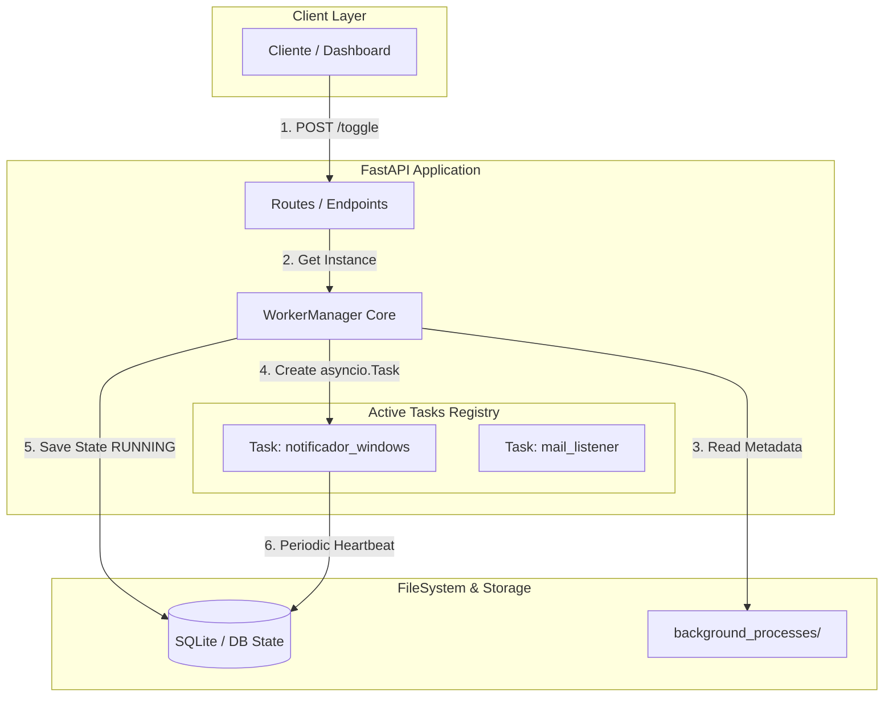
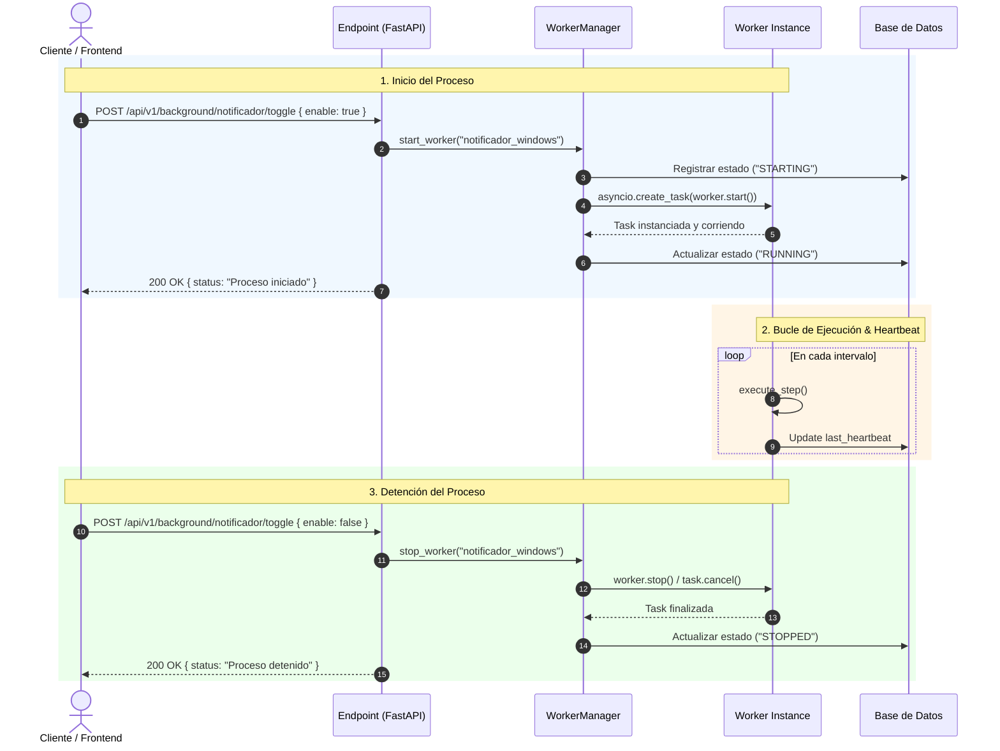

# Arquitectura: Sistema de Orquestación de Workers en FastAPI

Este documento detalla la arquitectura para implementar un **Worker Manager** (orquestador ligero en memoria/asíncrono) integrado directamente dentro de FastAPI, utilizando las capacidades de concurrencia nativas de Python (`asyncio.Task`).

---

## 🏗️ Diagrama de Arquitectura y Componentes



---

## 🔄 Diagrama de Secuencia: Ciclo de Vida del Worker



---

## 🛠️ Implementación del `WorkerManager`

### 1. Gestor Global (`background_processes/manager.py`)

```python
import asyncio
import importlib
from pathlib import Path
from typing import Dict, Optional

class WorkerManager:
  """
  Orquestador global en memoria para controlar tareas asíncronas en segundo plano.
  """

  def __init__(self):
    # Almacena las referencias a las asyncio.Task activas
    self._active_tasks: Dict[str, asyncio.Task] = {}
    # Almacena las instancias de las clases Worker
    self._worker_instances: Dict[str, object] = {}

  async def start_worker(self, worker_id: str, user_id: Optional[int] = None) -> bool:
    """Carga e inicia dinámicamente un worker en segundo plano."""
    if worker_id in self._active_tasks and not self._active_tasks[worker_id].done():
      return False  # Ya está corriendo

    # 1. Cargar dinámicamente la clase del worker
    module_path = f"background_processes.{worker_id}.worker"
    module = importlib.import_module(module_path)
    
    # Convierte 'notificador_windows' -> 'NotificadorWindowsWorker' (Convención)
    class_name = "".join(word.capitalize() for word in worker_id.split("_")) + "Worker"
    worker_class = getattr(module, class_name)

    # 2. Instanciar la clase
    worker_instance = worker_class()
    self._worker_instances[worker_id] = worker_instance

    # 3. Crear la tarea asíncrona no bloqueante
    task = asyncio.create_task(worker_instance.start())
    self._active_tasks[worker_id] = task

    return True

  async def stop_worker(self, worker_id: str, user_id: Optional[int] = None) -> bool:
    """Detiene y cancela la tarea asíncrona de un worker."""
    if worker_id not in self._active_tasks:
      return False

    # 1. Notificar detención limpia mediante el flag interno
    worker_instance = self._worker_instances.get(worker_id)
    if worker_instance and hasattr(worker_instance, "stop"):
      worker_instance.stop()

    # 2. Cancelar la Task de asyncio
    task = self._active_tasks[worker_id]
    task.cancel()

    # 3. Limpiar registros
    del self._active_tasks[worker_id]
    if worker_id in self._worker_instances:
      del self._worker_instances[worker_id]

    return True

  def get_status(self, worker_id: str) -> str:
    """Retorna el estado de ejecución de un worker."""
    if worker_id in self._active_tasks:
      task = self._active_tasks[worker_id]
      return "RUNNING" if not task.done() else "FINISHED"
    return "STOPPED"

# Instancia singleton accesible globalmente
worker_manager = WorkerManager()

```

---

## 📌 Ventajas de esta Arquitectura

1. **Ligera y Nativa:** No requiere la instalación de brokers externos como Redis, Celery o RabbitMQ.
2. **Ciclo de Vida Integrado:** Corre dentro del propio event loop de FastAPI/Uvicorn.
3. **Escalable a Clases:** Utiliza polimorfismo para invocar cualquier worker que respete la interfaz (`start()` / `stop()`).

