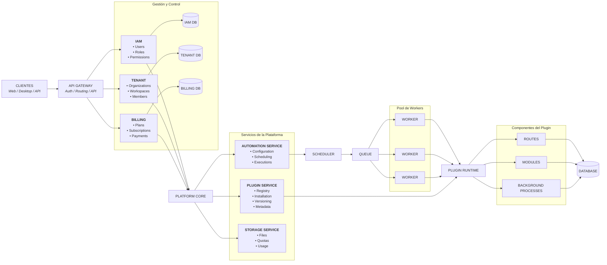
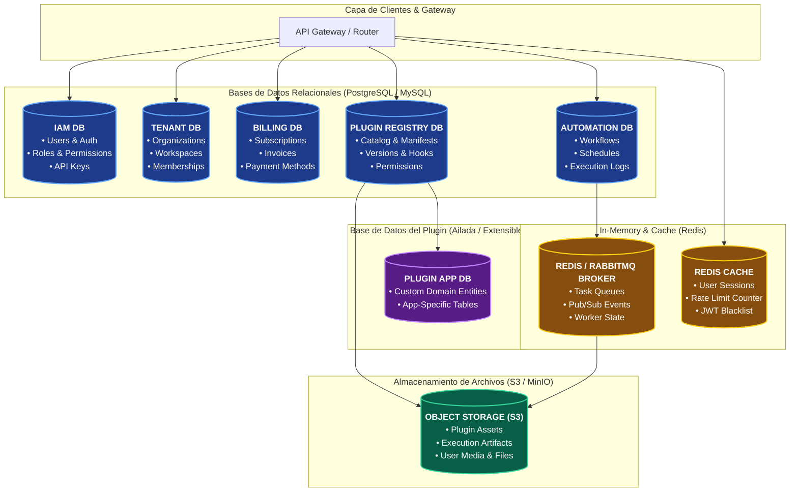
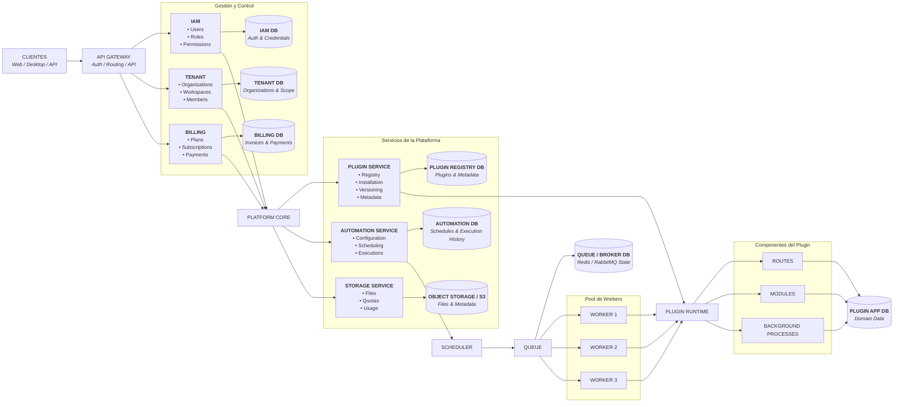
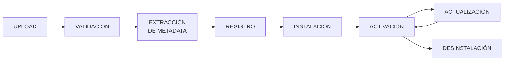

## 1. Descripción general

La plataforma se diseñará como un **framework de automatización extensible basado en Python**, utilizando una arquitectura orientada a microservicios y plugins.

El objetivo de la arquitectura es separar las responsabilidades principales de la plataforma y, al mismo tiempo, permitir que las automatizaciones puedan desarrollarse como componentes independientes.

La arquitectura se basa en cuatro conceptos principales:

1. **Core de plataforma**: administra usuarios, organizaciones, plugins, automatizaciones y configuración.
    
2. **Microservicios**: separan dominios funcionales y permiten escalar componentes independientemente.
    
3. **Runtime de ejecución**: procesa las automatizaciones mediante scheduler, cola y workers.
    
4. **Plugins**: encapsulan automatizaciones completas y sus recursos asociados.
    

---

# 2. Vista general




---

# 3. Principios arquitectónicos

La arquitectura seguirá los siguientes principios:

### Modularidad

Cada dominio funcional deberá estar separado y poseer responsabilidades claramente definidas.

### Bajo acoplamiento

Los servicios deberán comunicarse mediante contratos bien definidos, evitando dependencias directas innecesarias.

### Alta cohesión

Cada servicio deberá concentrar funcionalidades relacionadas con un mismo dominio.

### Extensibilidad

La incorporación de una nueva automatización no deberá requerir modificar el núcleo de la plataforma.

### Escalabilidad

Los componentes con mayor carga, especialmente los workers, deberán poder escalar independientemente.

### Seguridad

Los plugins deberán ejecutarse bajo un modelo de permisos y aislamiento progresivo.

### Versionado

Los plugins y contratos deberán utilizar versiones para permitir evolución sin romper instalaciones existentes.

---

# 4. Arquitectura de microservicios

La plataforma estará dividida en servicios según dominios de negocio.

## 4.1 API Gateway

Será el punto de entrada principal para los clientes.

Responsabilidades:

- Recibir solicitudes.
    
- Enrutar solicitudes.
    
- Validar autenticación.
    
- Aplicar políticas comunes.
    
- Gestionar comunicación con los servicios internos.
    

```text
Client
   │
   ▼
API Gateway
   │
   ├── /auth
   ├── /organizations
   ├── /plugins
   ├── /automations
   ├── /marketplace
   ├── /billing
   └── /storage
```

---

# 5. Identity Service

Responsable de la identidad de los usuarios.

### Funciones

- Registro.
    
- Autenticación.
    
- Gestión de sesiones/tokens.
    
- Información del usuario.
    
- Roles.
    
- Permisos.
    

Modelo conceptual:

```text
User
 │
 ├── Credentials
 ├── Roles
 └── Memberships
```

---

# 6. Tenant / Organization Service

Gestionará el aislamiento lógico entre usuarios y organizaciones.

```text
Platform
│
├── Personal Workspace
│
├── Organization A
│   ├── User 1
│   ├── User 2
│   └── User 3
│
└── Organization B
    ├── User 4
    └── User 5
```

Responsabilidades:

- Workspaces.
    
- Organizaciones.
    
- Membresías.
    
- Invitaciones.
    
- Roles organizacionales.
    
- Configuración de tenant.
    

---

# 7. Plugin Service

Será uno de los componentes principales de la plataforma.

Gestionará el ciclo de vida de los plugins.



## Responsabilidades

- Registrar plugins.
    
- Validar estructura.
    
- Leer metadata.
    
- Resolver dependencias.
    
- Instalar.
    
- Actualizar.
    
- Desinstalar.
    
- Gestionar versiones.
    
- Registrar permisos requeridos.
    

---

# 8. Contrato de Plugin

Todos los plugins deberán respetar una estructura definida.

```text
plugin/
│
├── metadata.json
├── config.py
│
├── database/
│
├── modules/
│
├── routes/
│
├── background_processes/
│   └── modules/
│
├── templates/
│
├── static/
│
└── docs/
```

Esta estructura permitirá que el runtime pueda interpretar un plugin sin necesidad de conocer previamente su implementación interna.

---

# 9. Sistema de Metadata

El archivo `metadata.json` funcionará como contrato declarativo entre el plugin y la plataforma.

Ejemplo conceptual:

```json
{
  "name": "riles-analyzer",
  "version": "1.0.0",
  "description": "Procesamiento automático de informes RILES",
  "author": "Development Team",
  "runtime": "python",
  "permissions": {
    "database": true,
    "network": true,
    "filesystem": true
  },
  "components": {
    "routes": true,
    "background_processes": true,
    "database": true
  },
  "documentation": {
    "enabled": true
  }
}
```

La metadata permitirá a la plataforma descubrir automáticamente:

- Componentes.
    
- Rutas.
    
- Procesos.
    
- Dependencias.
    
- Permisos.
    
- Documentación.
    
- Compatibilidad.
    
- Configuración.
    

---

# 10. Plugin Runtime

El Runtime será responsable de cargar y ejecutar los componentes de un plugin.

```text
Plugin
   │
   ▼
Metadata
   │
   ▼
Runtime
   │
   ├── Routes
   ├── Modules
   ├── Background Processes
   ├── Templates
   └── Database
```

El Runtime deberá mantener una separación clara entre:

```text
Platform Core
      │
      │ Contract
      ▼
Plugin Runtime
      │
      ▼
Plugin
```

Esto permitirá evolucionar el framework sin modificar directamente los plugins existentes.

---

# 11. Automation Service

Administrará las instancias configuradas de las automatizaciones.

Una distinción importante será:

```text
Plugin
  =
Código distribuible

Automation
  =
Instancia configurada de ese Plugin
```

Por ejemplo:

```text
Plugin:
RILES Analyzer

        ↓

Automation:
"Procesamiento RILES Empresa X"

        ↓

Configuration:
- Email
- Horario
- Base de datos
- Parámetros
```

Esto permitirá que un mismo plugin pueda ser utilizado por múltiples usuarios u organizaciones con diferentes configuraciones.

---

# 12. Scheduler

El Scheduler será responsable de determinar cuándo debe ejecutarse una automatización.

```text
Automation
     │
     ▼
Schedule
     │
     ▼
Scheduler
     │
     ▼
Execution Job
```

Ejemplos:

```text
Cada 10 minutos
Todos los días a las 08:00
Cada lunes
Cada 1 de mes
```

El Scheduler no deberá ejecutar directamente el código pesado.

Su responsabilidad será generar trabajos.

---

# 13. Queue

La cola desacoplará la programación de la ejecución.

```text
Scheduler
    │
    ▼
   Queue
    │
    ├── Job 1
    ├── Job 2
    ├── Job 3
    └── Job 4
```

Esto permite que los workers procesen los trabajos de forma independiente.

---

# 14. Worker Service

Los workers serán responsables de ejecutar las automatizaciones.

```text
Queue
 │
 ├── Worker 1
 ├── Worker 2
 └── Worker 3
```

Cada worker podrá:

1. Obtener un job.
    
2. Validar el contexto.
    
3. Cargar el plugin.
    
4. Preparar configuración.
    
5. Ejecutar el proceso.
    
6. Registrar logs.
    
7. Guardar el resultado.
    
8. Informar el estado.
    

Estados posibles:

```text
QUEUED
   ↓
RUNNING
   ↓
SUCCESS

RUNNING
   ↓
FAILED

RUNNING
   ↓
TIMEOUT

QUEUED
   ↓
CANCELLED
```

---

# 15. Ejecución distribuida

Una de las razones principales para utilizar workers independientes es permitir la futura distribución de carga.

```text
                 Queue
                   │
       ┌───────────┼───────────┐
       ▼           ▼           ▼
    Worker 1    Worker 2    Worker 3
       │           │           │
    Plugin A    Plugin B    Plugin C
```

Esto permitirá que el API principal permanezca disponible mientras se ejecutan procesos pesados.

---

# 16. Storage Service

El Storage Service gestionará archivos asociados a:

- Usuarios.
    
- Organizaciones.
    
- Plugins.
    
- Automatizaciones.
    
- Ejecuciones.
    

Se separará:

```text
Metadata
   ↓
Database

Files
   ↓
Object Storage
```

Esto evita almacenar grandes archivos directamente dentro de la base de datos.

---

# 17. Marketplace Service

El marketplace será responsable de administrar el catálogo de plugins.

```text
Developer
    │
    ▼
Publish Plugin
    │
    ▼
Marketplace
    │
    ├── Free
    ├── Paid
    ├── Subscription
    └── Enterprise
```

Los usuarios podrán:

- Buscar.
    
- Visualizar.
    
- Consultar documentación.
    
- Revisar versiones.
    
- Instalar.
    

---

# 18. Billing Service

El Billing Service separará la lógica de negocio relacionada con pagos de los demás servicios.

```text
User
 │
 ▼
Billing
 │
 ├── Plan
 ├── Subscription
 ├── Usage
 └── Payment
       │
       ▼
Payment Gateway
```

El sistema deberá recibir eventos externos mediante webhooks.

```text
Payment Gateway
      │
      ▼
Webhook
      │
      ▼
Billing Service
      │
      ▼
Subscription Updated
```

---

# 19. Modelo de planes

Los planes determinarán las capacidades disponibles.

```text
FREE
 │
 ├── Storage: 100 MB
 ├── Plugins: 3
 └── Executions: 100

PRO
 │
 ├── Storage: 10 GB
 ├── Plugins: 20
 └── Executions: 5.000

BUSINESS
 │
 ├── Storage: 100 GB
 ├── Plugins: 50+
 └── Executions: 25.000+
```

Los límites deberán ser aplicados por la plataforma y no únicamente mostrados en la interfaz.

---

# 20. RBAC

La plataforma utilizará un modelo de **Role-Based Access Control**.

Roles iniciales:

```text
Owner
Admin
Developer
Operator
Viewer
```

Ejemplo:

```text
Developer
 ├── plugin.install
 ├── plugin.update
 ├── automation.create
 └── automation.edit

Operator
 ├── automation.execute
 └── execution.read

Viewer
 └── execution.read
```

Los permisos se aplicarán sobre recursos pertenecientes al workspace correspondiente.

---

# 21. Multi-tenancy

Los datos deberán estar asociados a un `tenant` o `workspace`.

Conceptualmente:

```text
Tenant
 │
 ├── Users
 ├── Plugins
 ├── Automations
 ├── Executions
 ├── Storage
 └── Subscription
```

Las consultas y operaciones deberán validar el contexto del tenant antes de acceder a los recursos.

Esto evita que un usuario de una organización pueda acceder accidentalmente a recursos de otra.

---

# 22. Bases de datos

La arquitectura utilizará persistencia separada conceptualmente por dominio.

```text
Identity DB
Organization DB
Plugin DB
Automation DB
Billing DB
```

Sin embargo, para el MVP académico no será obligatorio desplegar una instancia física independiente de base de datos para cada microservicio.

La separación lógica será suficiente inicialmente.

Esta decisión reduce considerablemente la complejidad operacional sin eliminar la separación arquitectónica de los dominios.

---

# 23. Comunicación entre servicios

Los servicios podrán utilizar dos mecanismos principales.

## Comunicación síncrona

Para operaciones que requieren respuesta inmediata:

```text
API Gateway
      ↓
Plugin Service
      ↓
Response
```

Mediante HTTP/REST.

## Comunicación asíncrona

Para procesos que no requieren respuesta inmediata:

```text
Scheduler
    ↓
Queue
    ↓
Worker
```

Esto será especialmente importante para las automatizaciones de larga duración.

---

# 24. Documentación de Plugins

Cada plugin podrá contener documentación propia.

```text
plugin/
└── docs/
    ├── README.md
    ├── architecture.md
    ├── configuration.md
    └── workflow.md
```

La plataforma podrá renderizar:

```text
Markdown
   +
Mermaid
   ↓
Documentación web
```

Esto permitirá representar arquitecturas, flujos y dependencias sin separar la documentación del plugin.

---

# 25. Seguridad

La seguridad será abordada en diferentes niveles.

### Autenticación

Control de identidad mediante tokens/sesiones.

### Autorización

RBAC y permisos por recurso.

### Multi-tenancy

Aislamiento lógico de recursos.

### Plugins

Validación de paquetes y metadata.

### Ejecución

Control de:

- Timeout.
    
- Recursos.
    
- Permisos.
    
- Acceso a archivos.
    
- Acceso a red.
    

En una versión futura se podrá incorporar ejecución de plugins mediante contenedores o sandboxing más avanzado.

---

# 26. Modelo de ejecución completo

El flujo completo de una automatización será:

```text
                     USER
                       │
                       ▼
                  AUTOMATION
                       │
                       ▼
                    SCHEDULE
                       │
                       ▼
                   SCHEDULER
                       │
                       ▼
                     QUEUE
                       │
                       ▼
                    WORKER
                       │
                       ▼
                PLUGIN RUNTIME
                       │
            ┌──────────┼──────────┐
            ▼          ▼          ▼
          MODULES    ROUTES    BACKGROUND
                                  PROCESS
                       │
                       ▼
                    DATABASE
                       │
                       ▼
                    RESULT
                       │
                       ▼
                     USER
```

---

# 27. Ejemplo: Plugin RILES

El plugin utilizado como caso principal tendrá aproximadamente la siguiente arquitectura:

```text
riles-analyzer/
│
├── metadata.json
├── config.py
│
├── database/
│   └── models.py
│
├── modules/
│   ├── pdf_reader.py
│   ├── extractor.py
│   └── validator.py
│
├── routes/
│   └── riles_routes.py
│
├── background_processes/
│   ├── email_reader.py
│   └── modules/
│
├── templates/
│   └── review.html
│
├── static/
│   ├── src/
│   └── style/
│
└── docs/
    ├── README.md
    ├── architecture.md
    └── workflow.md
```

Su funcionamiento será:

```text
Email
 ↓
Background Process
 ↓
PDF
 ↓
PDF Reader
 ↓
Extraction
 ↓
Temporary DB
 ↓
API
 ↓
Web Interface
 ↓
Human Validation
 ↓
Final DB
```

---

# 28. Separación entre plataforma y plugins

Una regla arquitectónica fundamental será:

```text
                 PLATFORM
                    │
          ┌─────────┴─────────┐
          │                   │
      CONTRACT             RUNTIME
          │                   │
          └─────────┬─────────┘
                    │
                    ▼
                  PLUGIN
```

El núcleo de la plataforma **no deberá contener lógica específica de una automatización**.

Por ejemplo, el sistema no deberá tener:

```text
if plugin == "riles":
    ejecutar_riles()
```

En su lugar:

```text
Plugin
 ↓
Metadata
 ↓
Runtime
 ↓
Dynamic Loading
```

Esto permite incorporar nuevos plugins sin modificar el núcleo.

---

# 29. Evolución arquitectónica

La arquitectura permitirá evolucionar desde el MVP actual:

```text
FastAPI
   │
   ├── Automations
   ├── Background Processes
   ├── Routes
   └── Database
```

hacia:

```text
                    PLATFORM
                       │
        ┌──────────────┼──────────────┐
        ▼              ▼              ▼
      IAM          PLUGINS         BILLING
        │              │              │
        └──────────────┼──────────────┘
                       ▼
                  AUTOMATIONS
                       │
                    SCHEDULER
                       │
                      QUEUE
                       │
                    WORKERS
                       │
                    PLUGINS
```

Esta evolución permitirá conservar el trabajo realizado en el MVP y convertirlo progresivamente en un framework.

---

# 30. Arquitectura objetivo para el proyecto

La arquitectura final busca establecer una plataforma donde:

```text
                    PYTHON PLUGIN
                          │
                          ▼
                   metadata.json
                          │
                          ▼
                    PLUGIN SYSTEM
                          │
        ┌─────────────────┼─────────────────┐
        ▼                 ▼                 ▼
     ROUTES            MODULES          PROCESSES
        │                 │                 │
        └─────────────────┼─────────────────┘
                          ▼
                       RUNTIME
                          │
                     ┌────┴────┐
                     ▼         ▼
                 Scheduler    Manual
                     │         │
                     └────┬────┘
                          ▼
                        Queue
                          │
                     ┌────┴────┐
                     ▼         ▼
                   Worker    Worker
                     │         │
                     └────┬────┘
                          ▼
                       RESULT
```

La arquitectura propuesta convierte las automatizaciones en **componentes de software independientes, instalables y administrables**, mientras que los microservicios proporcionan separación de responsabilidades y capacidad de evolución.

El resultado esperado es una plataforma **Python-native, extensible y orientada a plugins**, capaz de evolucionar desde un framework interno de automatización hacia un ecosistema donde desarrolladores y empresas puedan crear, distribuir, instalar y ejecutar soluciones automatizadas.