## 1. Objetivo

El modelo de datos se diseñará siguiendo los principios de **normalización hasta Tercera Forma Normal (3NF)**.

La separación de responsabilidades entre microservicios permitirá que cada dominio posea sus propias entidades, evitando una base de datos monolítica y reduciendo el acoplamiento entre módulos.

> **Nota:** Para el MVP académico se podrá desplegar inicialmente sobre un único motor PostgreSQL, manteniendo separación lógica por esquemas. La arquitectura permitirá separar físicamente las bases de datos posteriormente.

---

# 2. Distribución de bases de datos

Se propone la siguiente división:

```text
┌─────────────────────────────────────────────────────────┐
│                    PLATFORM DATABASE                    │
│                                                         │
│  IAM / Organizations / Plugins / Automations / Billing │
└─────────────────────────────────────────────────────────┘

┌─────────────────────┐       ┌─────────────────────────┐
│   PLUGIN DATABASE   │       │   EXECUTION DATABASE    │
│                     │       │                         │
│ Registry            │       │ Executions              │
│ Versions            │       │ Jobs                    │
│ Dependencies        │       │ Logs                    │
└─────────────────────┘       └─────────────────────────┘

┌─────────────────────┐       ┌─────────────────────────┐
│   STORAGE DATABASE  │       │   MARKETPLACE DATABASE  │
│                     │       │                         │
│ Files               │       │ Listings                │
│ Quotas              │       │ Categories              │
│ Usage               │       │ Purchases               │
└─────────────────────┘       └─────────────────────────┘
```

En una primera implementación, estas bases pueden residir en una misma instancia PostgreSQL utilizando diferentes schemas.

---

# 3. Convenciones

Las tablas seguirán las siguientes convenciones:

- `snake_case`.
    
- Claves primarias con `UUID`.
    
- Claves foráneas explícitas.
    
- Fechas utilizando `TIMESTAMP WITH TIME ZONE`.
    
- Estados mediante valores controlados.
    
- Restricciones `UNIQUE` cuando corresponda.
    
- Índices sobre claves foráneas y campos de búsqueda frecuente.
    
- No almacenar información derivable innecesariamente.
    
- No utilizar listas serializadas en columnas relacionales.
    

---

# 4. Base de datos IAM

Responsable de identidad, usuarios, roles y permisos.

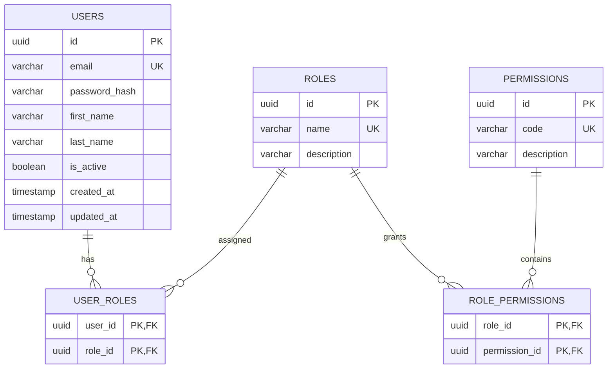

## Justificación 3NF

Las responsabilidades están separadas:

```text
USER
 ↓
USER_ROLES
 ↓
ROLE
 ↓
ROLE_PERMISSIONS
 ↓
PERMISSION
```

No se almacenan permisos directamente en `USERS`, evitando redundancia.

---

# 5. Base de datos de organizaciones

Esta base administra tenants, workspaces y membresías.

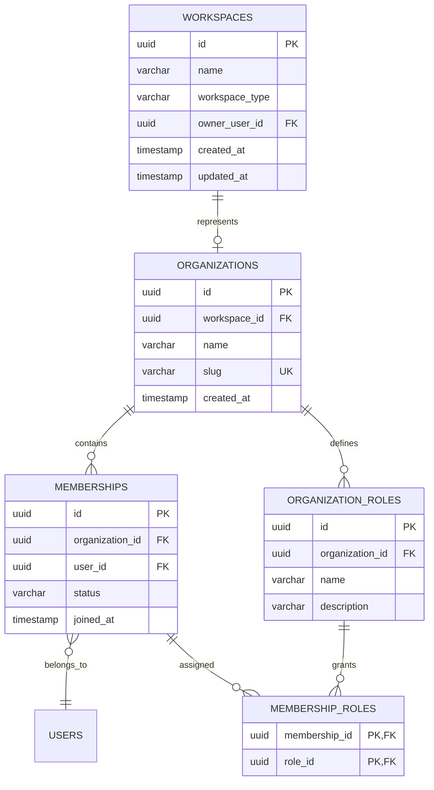

### Concepto importante

Se diferencia:

```text
User
  ↓
Membership
  ↓
Organization
```

Esto permite que un mismo usuario pertenezca a múltiples organizaciones.

---

# 6. Base de datos de plugins

Esta base contiene el registro de plugins disponibles e instalados.

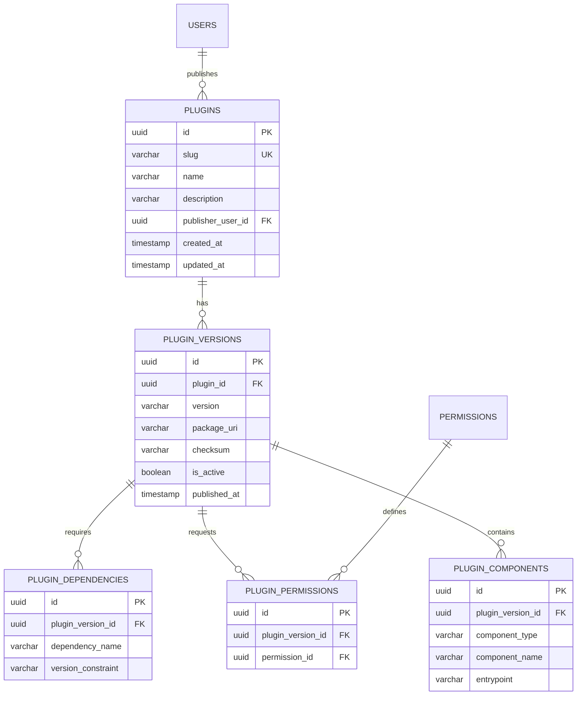

La metadata del plugin puede generar registros en estas tablas.

Por ejemplo:

```text
metadata.json
      ↓
Plugin Registry
      ↓
PLUGIN
PLUGIN_VERSION
PLUGIN_COMPONENT
PLUGIN_PERMISSION
PLUGIN_DEPENDENCY
```

---

# 7. Base de datos de automatizaciones

Aquí se diferencia claramente entre **plugin** y **automatización**.

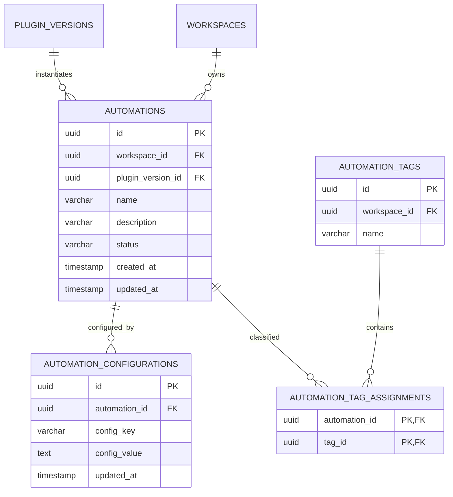

### Distinción

```text
Plugin
│
│ Código
│
▼
Plugin Version
│
│ Instancia
│
▼
Automation
│
│ Configuración
│
▼
Execution
```

Esto permite tener:

```text
RILES Analyzer 1.2.0
       │
       ├── Automation Empresa A
       ├── Automation Empresa B
       └── Automation Usuario C
```

sin duplicar el plugin.

---

# 8. Scheduler

El scheduler debe mantener separada la definición de horario de la automatización.

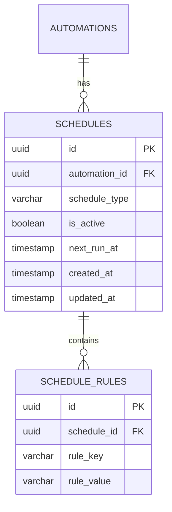

Ejemplo conceptual:

```text
SCHEDULE
│
├── type = CRON
│
└── RULES
    ├── minute = 0
    ├── hour = 8
    └── weekday = *
```

La implementación puede evolucionar posteriormente hacia una representación específica para cron.

---

# 9. Execution Database

Esta base registra las ejecuciones reales.

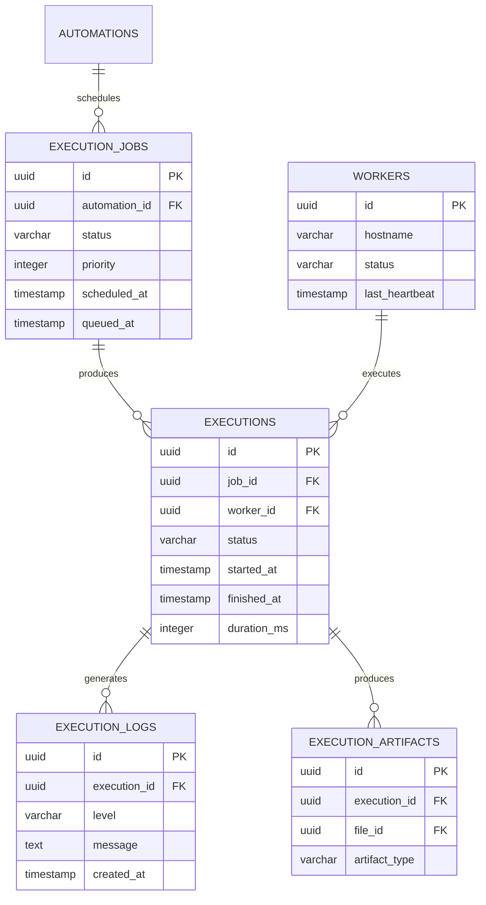

---

# 10. Storage Database

La información de los archivos se separará de los archivos físicos.

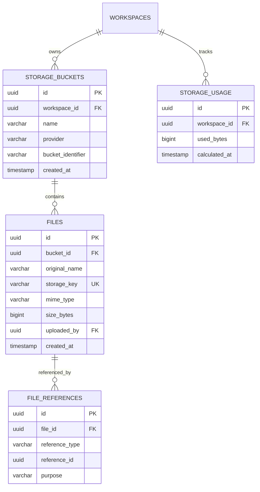

### Separación

```text
Database
   │
   └── Metadata del archivo

Object Storage
   │
   └── Archivo real
```

Esto permite cambiar posteriormente entre almacenamiento local, S3-compatible u otro proveedor sin modificar el modelo principal.

---

# 11. Marketplace

El marketplace necesita diferenciar el plugin técnico de su publicación comercial.

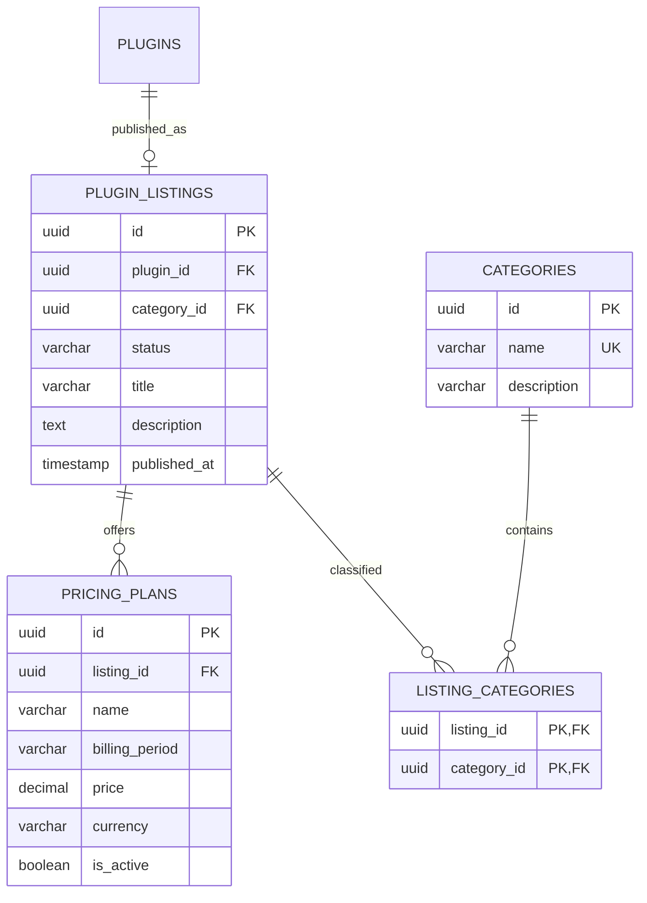

---

# 12. Instalación de plugins

La instalación debe registrarse para cada workspace.

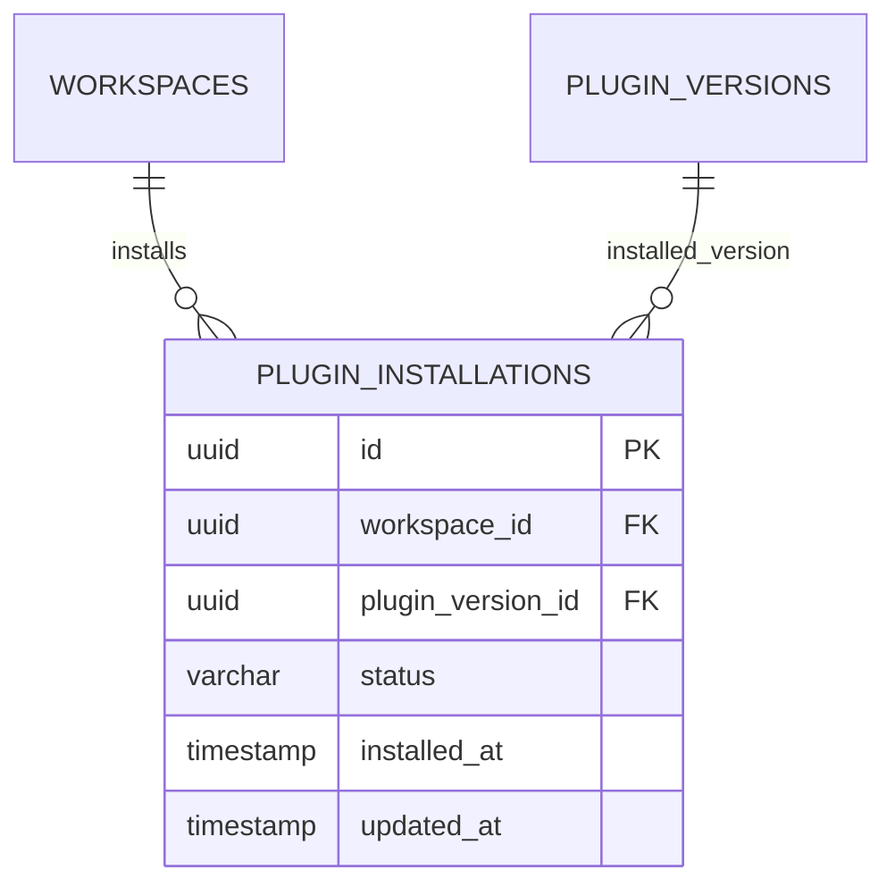

Esto permite que:

```text
Plugin 1.2.0
     │
     ├── Workspace A → 1.2.0
     ├── Workspace B → 1.1.0
     └── Workspace C → 1.2.0
```

mantenga diferentes versiones instaladas.

---

# 13. Billing

El sistema de billing separará planes, suscripciones y transacciones.

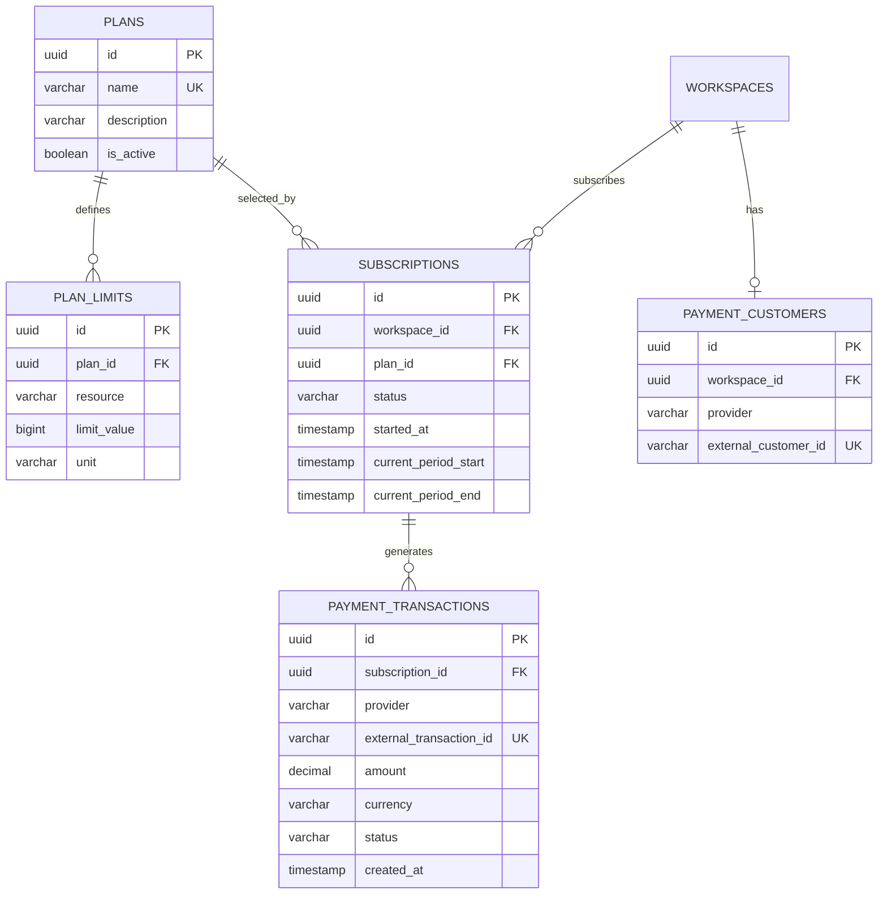

---

# 14. Uso y consumo

Para aplicar las cuotas de los planes, se registrará el consumo.

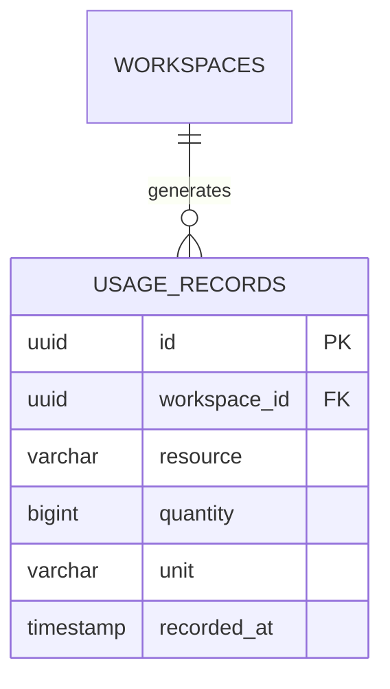

Ejemplos:

```text
storage
execution
plugin_installation
api_request
```

La información de consumo podrá ser agregada para determinar si el workspace ha alcanzado sus límites.

---

# 15. Diagrama global simplificado

El modelo completo puede representarse conceptualmente mediante:

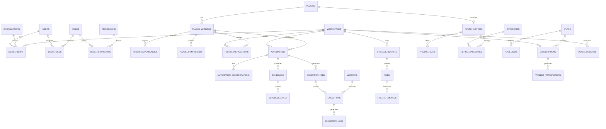

---

# 16. Principios de normalización aplicados

## Primera Forma Normal — 1NF

Cada atributo contiene un único valor atómico.

Incorrecto:

```text
permissions = "read,write,delete"
```

Correcto:

```text
ROLE_PERMISSIONS
----------------
role_id
permission_id
```

---

## Segunda Forma Normal — 2NF

Las tablas con claves compuestas no deberán contener atributos que dependan únicamente de una parte de la clave.

Por ejemplo:

```text
USER_ROLES
----------
user_id
role_id
```

No se almacenará aquí información propia del usuario o del rol.

---

## Tercera Forma Normal — 3NF

Los atributos no clave deberán depender únicamente de la clave primaria.

Por ejemplo, en lugar de:

```text
SUBSCRIPTIONS

id
workspace_id
plan_id
plan_name
plan_price
```

se utiliza:

```text
SUBSCRIPTIONS
id
workspace_id
plan_id
```

y:

```text
PLANS
id
name
```

De esta forma:

```text
Subscription
     │
     └── plan_id
             │
             ▼
            Plan
```

evitando dependencias transitivas.

---

# 17. Principio de independencia de servicios

Aunque el modelo completo se presenta como un conjunto para facilitar la comprensión del proyecto, la implementación podrá distribuir las entidades entre servicios.

```text
IAM Service
 └── Users
 └── Roles
 └── Permissions

Tenant Service
 └── Workspaces
 └── Organizations
 └── Memberships

Plugin Service
 └── Plugins
 └── Versions
 └── Dependencies

Automation Service
 └── Automations
 └── Schedules

Execution Service
 └── Jobs
 └── Executions
 └── Logs

Storage Service
 └── Files
 └── Buckets

Marketplace Service
 └── Listings
 └── Categories
 └── Pricing

Billing Service
 └── Plans
 └── Subscriptions
 └── Payments
```

En producción, cada servicio podrá evolucionar hacia una base de datos independiente.

---

# 18. Estrategia para el MVP

Para evitar una complejidad innecesaria durante el proyecto de título, se recomienda implementar inicialmente:

```text
PostgreSQL
│
├── iam
├── tenant
├── plugins
├── automations
├── executions
├── storage
├── marketplace
└── billing
```

En lugar de desplegar inmediatamente ocho servidores de base de datos.

La **separación lógica de dominios** permitirá demostrar el diseño de microservicios sin introducir una carga operacional innecesaria.

Posteriormente:

```text
                 PostgreSQL
                     │
          ┌──────────┼──────────┐
          ▼          ▼          ▼
       IAM DB    Plugin DB   Billing DB
          │          │          │
          └──────────┼──────────┘
                     ▼
                Distributed
```

podrá evolucionar hacia bases independientes según las necesidades de escalabilidad.

---

# 19. Relación con la arquitectura de plugins

El modelo de datos está diseñado para que el plugin sea **un producto distribuible**, mientras que la automatización sea **una instancia ejecutable**.

La relación fundamental será:

```text
PLUGIN
   │
   └── PLUGIN_VERSION
           │
           ├── COMPONENTS
           ├── DEPENDENCIES
           └── PERMISSIONS
                    │
                    ▼
             INSTALLATION
                    │
                    ▼
              AUTOMATION
                    │
                    ▼
                SCHEDULE
                    │
                    ▼
              EXECUTION JOB
                    │
                    ▼
                EXECUTION
                    │
             ┌──────┴──────┐
             ▼             ▼
           LOGS        ARTIFACTS
```

Esta separación es especialmente importante para el proyecto porque permite que **un mismo plugin pueda ser distribuido, versionado e instalado por múltiples usuarios u organizaciones sin duplicar su definición técnica**.