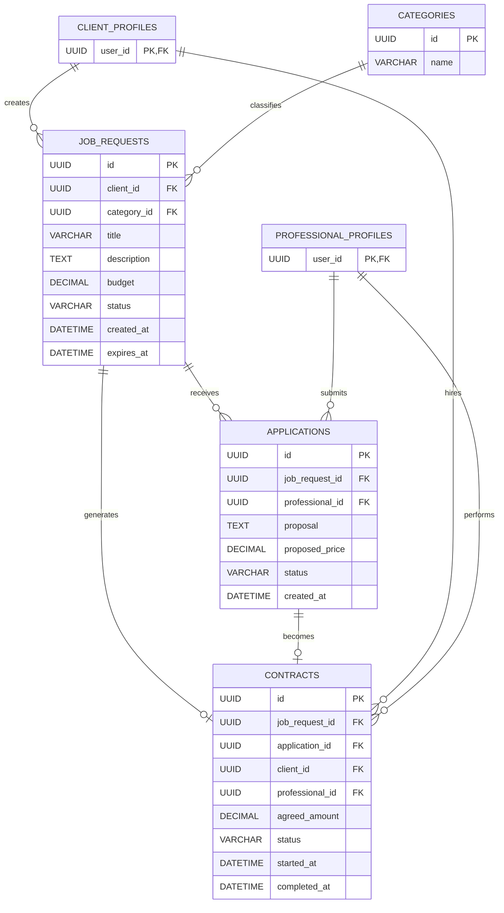
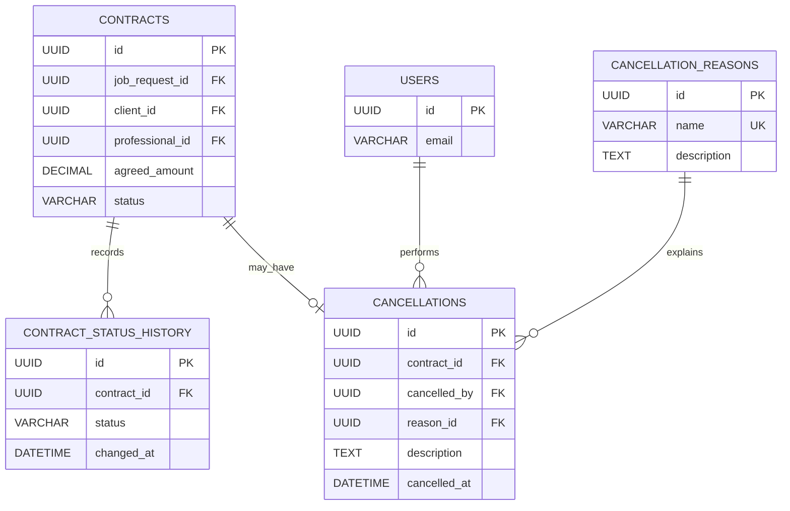
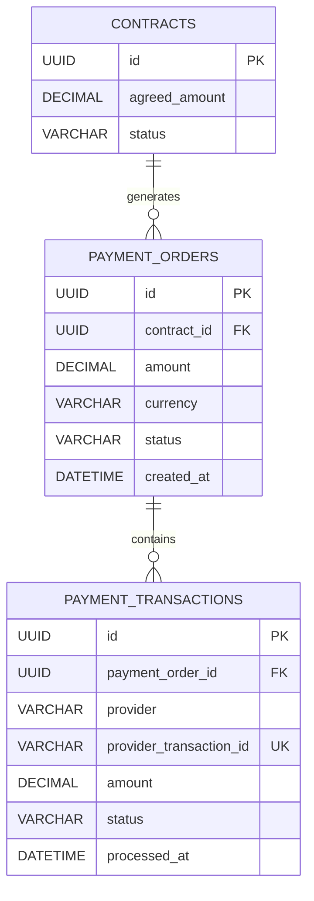
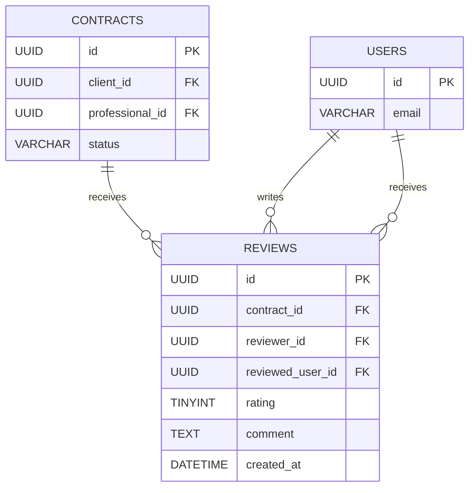
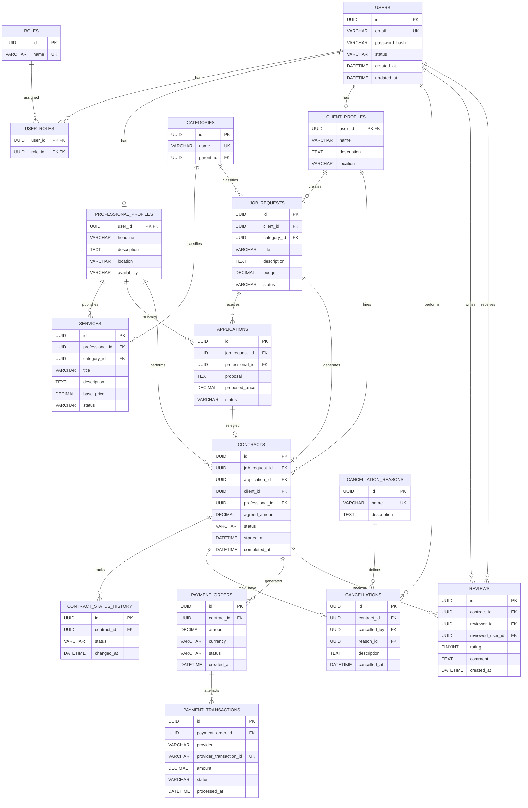

<!-- Inicio: Alcance (1).md -->

## Alcance del proyecto

### 1. Gestión de usuarios

La plataforma tendrá dos roles principales:

- **Cliente:** publica necesidades, revisa profesionales, contrata y realiza pagos.
- **Profesional:** crea su perfil, ofrece sus servicios, postula a trabajos y recibe evaluaciones.

También existirá un tercer rol:

- **Administrador:** supervisa y gestiona el funcionamiento de la plataforma.

El sistema deberá contemplar:

- Registro e inicio de sesión.
- Recuperación de contraseña.
- Autenticación.
- Autorización según rol.
- Edición del perfil.
- Activación/desactivación de cuenta.

---

### 2. Perfil profesional

El profesional podrá construir un perfil orientado a mostrar sus capacidades.

Deberá poder registrar:

- Información personal/profesional.
- Descripción.
- Especialidades.
- Habilidades.
- Experiencia.
- Disponibilidad.
- Rango de precios.
- Portafolio, opcionalmente.

El perfil deberá mostrar además información derivada del funcionamiento de la plataforma:

- Calificación promedio.
- Reseñas.
- Cantidad de cancelaciones.
- Porcentaje de cumplimiento, si decides incorporarlo.

**Importante:** la cantidad de trabajos realizados no debería funcionar como mecanismo directo de reputación, de acuerdo con la problemática que planteaste. Así un profesional nuevo no queda automáticamente en desventaja frente a uno antiguo.

---

### 3. Publicación de necesidades

El cliente podrá publicar un trabajo o requerimiento.

Cada publicación podrá contener:

- Título.
- Descripción.
- Categoría.
- Habilidades requeridas.
- Presupuesto.
- Fecha límite.
- Modalidad.
- Estado.

Los trabajos podrán pasar por estados como:

**Publicado → En selección → Contratado → En ejecución → Finalizado**

También deberán contemplarse estados de cancelación.

---

### 4. Búsqueda y descubrimiento

El sistema permitirá encontrar profesionales y trabajos mediante:

- Búsqueda por texto.
- Categorías.
- Habilidades.
- Disponibilidad.
- Rango de precios.
- Calificación.
- Otros filtros relevantes.

Aquí estaría una de las partes más interesantes de tu proyecto: **el mecanismo de coincidencia entre las necesidades del cliente y las capacidades del profesional**.

Por ejemplo:

> Cliente necesita "desarrollo web + React + Node.js".

El sistema puede determinar qué profesionales poseen esas habilidades y ordenarlos según determinados criterios.

Esto puede convertirse incluso en uno de los elementos diferenciadores del proyecto.

---

### 5. Sistema de postulaciones

El profesional podrá postular a trabajos publicados.

La propuesta deberá contener, como mínimo:

- Mensaje/propuesta.
- Precio ofrecido.
- Plazo estimado.
- Fecha de postulación.

El cliente podrá:

- Revisar postulaciones.
- Comparar profesionales.
- Aceptar una propuesta.
- Rechazar propuestas.

Cuando una propuesta sea aceptada, se generará el **acuerdo de trabajo**.

---

### 6. Gestión del trabajo

Una vez seleccionado el profesional, el sistema deberá administrar el ciclo de vida del servicio.

Por ejemplo:

Postulación aceptada

        ↓

Pago pendiente

        ↓

Pago confirmado

        ↓

Trabajo en ejecución

        ↓

Trabajo finalizado

        ↓

Evaluación

El sistema deberá mantener registro de:

- Cliente.
- Profesional.
- Trabajo.
- Precio acordado.
- Fecha de inicio.
- Fecha de término.
- Estado.
- Pago asociado.
- Evaluaciones.

---

# 7. Pasarela de pagos

Este módulo pasa a ser **parte central del alcance**.

La plataforma deberá integrarse con una pasarela de pagos externa mediante su API/SDK.

El sistema deberá permitir:

### Creación del pago

Cuando el cliente acepte una propuesta:

1. Se crea la orden.
2. Se registra el monto.
3. Se genera la solicitud de pago.
4. El cliente es dirigido al proceso de pago.

### Confirmación

La plataforma deberá recibir la confirmación de la pasarela.

Idealmente mediante:

**Webhook → Backend → Actualización del estado del pago**

Por ejemplo:

PENDIENTE

    ↓

PAGO INICIADO

    ↓

PAGADO

Y también:

PENDIENTE

    ↓

RECHAZADO

### Historial

Cada transacción deberá quedar registrada con información como:

- Identificador interno.
- Identificador de la transacción externa.
- Trabajo asociado.
- Cliente.
- Monto.
- Fecha.
- Estado.
- Proveedor de pago.

### Seguridad

Tu plataforma **no debería almacenar números de tarjeta, CVV ni información financiera sensible**.

La pasarela se encargará del procesamiento de esos datos.

Esto es importante tanto técnicamente como para delimitar correctamente el proyecto.

---

# 8. Cancelaciones y reembolsos

Dado que decidiste que las cancelaciones formen parte de la reputación, este módulo también debe estar incluido.

El sistema deberá contemplar:

- Cancelación por cliente.
- Cancelación por profesional.
- Motivo de cancelación.
- Momento de cancelación.
- Trabajo asociado.
- Estado del pago.

Y, si la pasarela seleccionada lo permite:

- Solicitud de reembolso.
- Registro del reembolso.
- Estado del reembolso.

Esto permite que las cancelaciones tengan consecuencias medibles sin convertir la cantidad de trabajos completados en una ventaja artificial.

---

# 9. Sistema de reputación

El sistema permitirá evaluar la experiencia entre ambas partes.

Después de finalizar un trabajo:

**Cliente → evalúa profesional**

Y potencialmente:

**Profesional → evalúa cliente**

Las evaluaciones pueden incluir:

- Calificación.
- Comentario.
- Fecha.
- Trabajo asociado.

Además, el sistema registrará las cancelaciones.

### Principio de reputación

La reputación no dependerá exclusivamente de la antigüedad.

Un profesional nuevo podría tener:

> 2 trabajos + 5 estrellas + 0 cancelaciones

y competir razonablemente con alguien que tenga:

> 100 trabajos + 4,6 estrellas + 8 cancelaciones.

Esto es precisamente una de las hipótesis interesantes que podrías investigar en tu proyecto.

---

# 10. Notificaciones

El sistema deberá informar eventos importantes.

Por ejemplo:

- Nueva postulación.
- Postulación aceptada.
- Postulación rechazada.
- Pago confirmado.
- Pago rechazado.
- Trabajo iniciado.
- Trabajo finalizado.
- Trabajo cancelado.
- Nueva evaluación.

Inicialmente podrían ser **notificaciones dentro de la plataforma**, evitando añadir complejidad innecesaria con SMS, WhatsApp, etc.

---

# 11. Panel administrativo

El administrador contará con un dashboard desde donde podrá:

### Usuarios

- Consultar usuarios.
- Bloquear/desbloquear cuentas.
- Revisar perfiles.

### Trabajos

- Consultar publicaciones.
- Ocultar publicaciones.
- Revisar trabajos cancelados.

### Transacciones

- Consultar pagos.
- Consultar estados.
- Revisar reembolsos.

### Reputación

- Revisar evaluaciones.
- Gestionar denuncias.

### Estadísticas

Por ejemplo:

- Usuarios registrados.
- Profesionales activos.
- Trabajos publicados.
- Trabajos completados.
- Trabajos cancelados.
- Monto total transaccionado.
- Tasa de cancelación.
- Calificación promedio.

---

# 12. Seguridad

Como habrá cuentas y pagos, la seguridad debe formar parte explícita del alcance.

Como mínimo:

- Contraseñas almacenadas mediante hash seguro.
- Autenticación.
- Autorización basada en roles.
- Protección de endpoints.
- Validación de datos.
- Control de acceso a recursos.
- Protección frente a ataques comunes.
- Manejo seguro de credenciales/API keys.
- No almacenar información sensible de tarjetas.
- Registro de eventos relevantes.

---

# Resumen 

El proyecto contempla el diseño, desarrollo e implementación de una plataforma web para la intermediación de servicios profesionales independientes, permitiendo a clientes publicar requerimientos y contratar profesionales mediante un sistema de búsqueda, postulación y selección. La plataforma incorporará gestión de perfiles profesionales, administración del ciclo de vida de los trabajos, integración con una pasarela de pagos externa, seguimiento de transacciones, gestión de cancelaciones, sistema de reputación basado en evaluaciones y comportamiento, notificaciones y herramientas de administración.

La solución contemplará una arquitectura cliente-servidor, una API para la gestión de los servicios, persistencia de información y comunicación con servicios externos de pago. La plataforma no almacenará información financiera sensible, delegando el procesamiento de los medios de pago al proveedor especializado.

El sistema estará orientado a favorecer una competencia equilibrada entre profesionales, evitando utilizar la cantidad de trabajos realizados o la antigüedad como factores principales de posicionamiento, considerando en cambio indicadores asociados a la calidad del servicio, evaluaciones y comportamiento de los usuarios.

---

<!-- Inicio: Arquitectura (2).md -->

## 1. Funcionalidades principales

Para el portal de talento freelancer, veo estas áreas funcionales:

1. **Gestión de usuarios**
    - Registro e inicio de sesión.
        
    - Roles: cliente y profesional.
        
    - Perfil.
        
    - Datos de contacto.
        
    - Estado de la cuenta.
        
2. **Gestión de profesionales**
    
    - Perfil profesional.
        
    - Especialidades.
        
    - Portafolio.
        
    - Disponibilidad.
        
    - Tarifas.
        
    - Experiencia.
        
3. **Publicación y búsqueda de proyectos**
    
    - Cliente publica un proyecto.
        
    - Profesionales buscan proyectos.
        
    - Filtros y búsqueda.
        
    - Categorías.
        
    - Estado del proyecto.
        
4. **Postulaciones / contratación**
    
    - Profesional postula.
        
    - Cliente revisa postulaciones.
        
    - Cliente acepta/rechaza.
        
    - Creación del vínculo contractual.
        
    - Estados del trabajo.
        
5. **Gestión del trabajo**
    
    - Inicio del trabajo.
        
    - Entrega.
        
    - Aprobación.
        
    - Solicitud de cambios.
        
    - Finalización.
        
    - Cancelación.
        
6. **Pagos**
    
    - Pago del cliente.
        
    - Retención/liberación del dinero.
        
    - Comisión de la plataforma.
        
    - Estado del pago.
        
    - Reembolsos, si están contemplados.
        
7. **Reputación**
    
    - Calificación después de finalizar un trabajo.
        
    - Comentarios.
        
    - Historial de cancelaciones.
        
    - Indicadores de confiabilidad.
        
8. **Notificaciones**
    
    - Nueva postulación.
        
    - Postulación aceptada/rechazada.
        
    - Pago realizado.
        
    - Entrega.
        
    - Cambios de estado.
        
    - Etc.
        

---

# 2. Microservicios que propondría

No convertiría cada funcionalidad anterior en un microservicio.

Propongo **6 microservicios principales + API Gateway**.

```text
                         ┌──────────────────────┐
                         │      Frontend        │
                         │ Web / SPA            │
                         └──────────┬───────────┘
                                    │
                                    ▼
                         ┌──────────────────────┐
                         │     API Gateway      │
                         └──────────┬───────────┘
                                    │
             ┌──────────────────────┼──────────────────────┐
             │                      │                      │
             ▼                      ▼                      ▼
     ┌───────────────┐      ┌───────────────┐      ┌───────────────┐
     │ Auth / Users  │      │   Projects    │      │   Contracts   │
     │   Service     │      │    Service    │      │    Service    │
     └───────────────┘      └───────────────┘      └───────────────┘
             │                      │                      │
             │                      │                      │
             └──────────────────────┼──────────────────────┘
                                    │
                    ┌───────────────┼───────────────┐
                    ▼               ▼               ▼
             ┌─────────────┐ ┌─────────────┐ ┌──────────────┐
             │   Payment   │ │ Reputation  │ │Notification  │
             │   Service   │ │   Service   │ │   Service    │
             └─────────────┘ └─────────────┘ └──────────────┘
```

### Microservicio 1 — Identity / Users

Responsable de todo lo relacionado con la identidad.

**Incluye:**

- Registro.
    
- Login.
    
- JWT/OAuth.
    
- Roles.
    
- Usuarios.
    
- Perfil básico.
    
- Recuperación de contraseña.
    
- Estado de cuenta.
    

No separaría `Auth` y `Users` en dos servicios. Para el tamaño del proyecto sería una fragmentación innecesaria.

---

### Microservicio 2 — Talent / Projects

Aquí haría una consideración importante.

Podríamos tener:

```text
Talent Service
Projects Service
```

pero **no lo recomiendo inicialmente**.

El servicio puede administrar el dominio de marketplace:

- Perfil profesional.
    
- Especialidades.
    
- Portafolio.
    
- Proyectos publicados.
    
- Categorías.
    
- Búsqueda.
    
- Filtros.
    
- Postulaciones.
    

La razón es que estos elementos están muy relacionados dentro del proceso de descubrimiento:

```text
Profesional
     │
     ├── Especialidades
     ├── Portafolio
     └── Perfil
          │
          ▼
       Proyectos
          │
          ▼
     Postulación
```

Podemos denominarlo inicialmente **Marketplace Service**.

---

### Microservicio 3 — Contracts / Work

Este es uno de los servicios más importantes.

Una vez aceptada una postulación:

```text
Proyecto
   ↓
Postulación aceptada
   ↓
Contrato
   ↓
Trabajo
   ↓
Entrega
   ↓
Aprobación
   ↓
Finalización
```

Este servicio manejaría:

- Contratos.
    
- Estado del trabajo.
    
- Entregas.
    
- Solicitudes de modificación.
    
- Aprobaciones.
    
- Cancelaciones.
    
- Historial del trabajo.
    

Esto permite que el concepto de **trabajo contratado** tenga un dominio independiente.

---

### Microservicio 4 — Payments

Este debe ser independiente.

Y aquí entra directamente el requisito que mencionaste anteriormente de que el proyecto debe tener **pasarela de pagos**.

Responsabilidades:

- Crear intención de pago.
    
- Procesar pago mediante la pasarela.
    
- Registrar transacción.
    
- Comisión de la plataforma.
    
- Estado del pago.
    
- Liberación del pago.
    
- Reembolso, si se implementa.
    
- Webhooks de la pasarela.
    

Importante: **no almacenaría datos de tarjetas**.

El sistema debería trabajar con un proveedor externo mediante tokens/IDs de transacción.

Por ejemplo:

```text
Frontend
   │
   ▼
API Gateway
   │
   ▼
Payment Service
   │
   ▼
Payment Provider
   │
   ▼
Webhook
   │
   ▼
Payment Service
```

Esto además te da un componente técnico bastante defendible para el proyecto de título.

---

### Microservicio 5 — Reputation

Responsable exclusivamente de la reputación.

Pero siguiendo la decisión que ya estableciste, **los trabajos realizados no deberían utilizarse como una métrica de reputación que perjudique a los usuarios nuevos**.

Podría manejar:

- Calificación recibida.
    
- Comentarios.
    
- Calificaciones como cliente/profesional.
    
- Porcentaje de cancelaciones.
    
- Historial de cancelaciones.
    
- Indicadores derivados.
    

Por ejemplo:

```text
Usuario nuevo

Trabajos realizados: 0
Calificaciones: 0
Cancelaciones: 0

Reputación:
"Sin evaluaciones"
```

Mientras que:

```text
Usuario B

Trabajos realizados: 120
Calificación: 4.8
Cancelaciones: 2%

Reputación:
4.8 / 5
Confiabilidad: 98%
```

Esto evita que la antigüedad se convierta automáticamente en una ventaja injusta.

---

### Microservicio 6 — Notifications

Este sería pequeño pero útil para demostrar comunicación entre servicios.

Puede manejar:

- Email.
    
- Notificaciones internas.
    
- Eventos.
    
- Cambios de estado.
    

Por ejemplo:

```text
Payment Service
       │
       │ PaymentCompleted
       ▼
Notification Service
       │
       ├── Email al profesional
       └── Notificación al cliente
```

Esto también permite justificar el uso de **comunicación asíncrona/eventos**.

---

# 3. API Gateway

Aunque técnicamente no sea un microservicio de negocio, lo incluiría en la arquitectura.

El frontend no debería conocer:

```text
http://users-service:3000
http://projects-service:3001
http://payments-service:3002
...
```

En su lugar:

```text
Frontend
    │
    ▼
API Gateway
    │
    ├── /auth/*
    ├── /users/*
    ├── /projects/*
    ├── /contracts/*
    ├── /payments/*
    ├── /reputation/*
    └── /notifications/*
```

Esto simplifica considerablemente el frontend y centraliza aspectos como:

- Autenticación.
    
- Autorización.
    
- Rate limiting.
    
- Routing.
    
- CORS.
    
- Logging.
    

---

# 4. No haría microservicios para todo

Por ejemplo, **no crearía**:

```text
Category Service
Portfolio Service
Review Service
Cancellation Service
Application Service
Delivery Service
Email Service
Search Service
Commission Service
```

aunque técnicamente sea posible.

Para un proyecto académico con aproximadamente **3 meses y medio**, sería contraproducente.

El objetivo debería ser algo como:

|Componente|Responsabilidad|
|---|---|
|API Gateway|Entrada al sistema|
|Identity/User|Usuarios y autenticación|
|Marketplace|Talento, proyectos y postulaciones|
|Work/Contracts|Contratación y ejecución|
|Payments|Pagos y transacciones|
|Reputation|Calificaciones y cancelaciones|
|Notifications|Comunicación/eventos|

**7 componentes principales** contando el Gateway.

Eso me parece un equilibrio bastante bueno.

---

# 5. Base de datos

También recomiendo **una base de datos por microservicio**, aunque no necesariamente tecnologías diferentes.

Por ejemplo:

```text
Identity Service
       │
       └── identity_db

Marketplace Service
       │
       └── marketplace_db

Work Service
       │
       └── work_db

Payment Service
       │
       └── payment_db

Reputation Service
       │
       └── reputation_db

Notification Service
       │
       └── notification_db
```

No haría esto:

```text
             ┌──────────────┐
Users ───────┤              │
Projects ────┤   MySQL      │
Payments ────┤              │
Reviews ─────┤              │
             └──────────────┘
```

porque tendrías servicios independientes compartiendo una misma base de datos, lo que debilita bastante la justificación de la arquitectura de microservicios.

---

# 6. Comunicación entre servicios

Aquí también conviene **no complicarse demasiado**.

Utilizaría dos mecanismos:

### Comunicación síncrona

REST/HTTP para operaciones que necesitan una respuesta inmediata.

Por ejemplo:

```text
Frontend
   ↓
Gateway
   ↓
Marketplace
```

### Comunicación asíncrona

Un broker/event bus para eventos.

Por ejemplo:

```text
Work Service
     │
     │ WorkCompleted
     ▼
 Message Broker
     │
     ├───────────────► Reputation Service
     │
     └───────────────► Notification Service
```

No necesitas implementar un sistema extremadamente complejo. Lo importante es demostrar **por qué existe comunicación asíncrona**.

---

# 7. Flujo principal del sistema

La arquitectura se vuelve mucho más fácil de justificar si la mostramos mediante el flujo principal:

```text
                    CLIENTE
                       │
                       ▼
                Publica proyecto
                       │
                       ▼
              ┌─────────────────┐
              │   Marketplace   │
              └────────┬────────┘
                       │
                       ▼
                PROFESIONAL
                       │
                       ▼
                   Postula
                       │
                       ▼
              ┌─────────────────┐
              │   Marketplace   │
              └────────┬────────┘
                       │
                       ▼
                  Cliente acepta
                       │
                       ▼
              ┌─────────────────┐
              │  Work/Contract  │
              └────────┬────────┘
                       │
                       ▼
                    Trabajo
                       │
                       ▼
                    Entrega
                       │
                       ▼
                    Cliente
                    aprueba
                       │
                       ▼
              ┌─────────────────┐
              │    Payments     │
              └────────┬────────┘
                       │
                       ▼
                Liberación pago
                       │
                       ├──────────────┐
                       ▼              ▼
                 Reputation     Notifications
```

Este flujo debería ser **el corazón de la arquitectura**.

---

# 8. Lo que yo priorizaría para diciembre

Con el plazo que tienes, propondría dividir el desarrollo en tres niveles.

### MVP obligatorio

Debe funcionar sí o sí:

- Registro/login.
    
- Perfiles.
    
- Publicación de proyectos.
    
- Búsqueda.
    
- Postulaciones.
    
- Aceptación.
    
- Contrato/trabajo.
    
- Entrega.
    
- Aprobación.
    
- Pago real mediante pasarela.
    
- Comisión.
    
- Calificación.
    
- Cancelación.
    
- Notificaciones básicas.
    

### Funcionalidades secundarias

Si queda tiempo:

- Filtros avanzados.
    
- Portafolio avanzado.
    
- Notificaciones en tiempo real.
    
- Dashboard.
    
- Estadísticas.
    
- Reembolsos.
    
- Sistema de favoritos.
    

### No prioritario

Yo evitaría inicialmente:

- Chat complejo.
    
- Videollamadas.
    
- Sistema de disputas sofisticado.
    
- IA para matching.
    
- Recomendaciones mediante ML.
    
- Búsqueda semántica.
    
- Aplicación móvil.
    
- Múltiples pasarelas de pago.
    

Todas esas cosas pueden aparecer como **trabajo futuro**, pero no deberían poner en riesgo el MVP.

---

## 9. Arquitectura objetivo

Por lo tanto, mi propuesta inicial sería:

```text
                         ┌─────────────────┐
                         │    FRONTEND     │
                         └────────┬────────┘
                                  │
                                  ▼
                         ┌─────────────────┐
                         │   API GATEWAY   │
                         └────────┬────────┘
                                  │
       ┌──────────────────────────┼──────────────────────────┐
       │                          │                          │
       ▼                          ▼                          ▼
┌──────────────┐          ┌──────────────┐          ┌──────────────┐
│   Identity   │          │ Marketplace  │          │     Work     │
│    Service   │          │    Service   │          │   Service    │
└──────┬───────┘          └──────┬───────┘          └──────┬───────┘
       │                          │                          │
       ▼                          ▼                          ▼
 identity_db              marketplace_db                 work_db


       ┌──────────────────────────┼──────────────────────────┐
       │                          │                          │
       ▼                          ▼                          ▼
┌──────────────┐          ┌──────────────┐          ┌──────────────┐
│   Payments   │          │  Reputation  │          │Notifications │
│   Service    │          │   Service    │          │   Service    │
└──────┬───────┘          └──────┬───────┘          └──────┬───────┘
       │                          │                          │
       ▼                          ▼                          ▼
 payment_db               reputation_db              notification_db
       │
       ▼
┌─────────────────┐
│ Payment Gateway │
│    externa      │
└─────────────────┘


                 ┌─────────────────────┐
                 │    Message Broker   │
                 └─────────────────────┘
                    ▲       ▲       ▲
                    │       │       │
                  Work   Payments  Reputation
```

### Mi recomendación

**No agregaría más microservicios por ahora.** Primero definiría estos dominios y, especialmente, las **fronteras de datos y responsabilidades**. Después podemos pasar a diseñar cada uno con sus endpoints, entidades, eventos y dependencias.

El siguiente paso importante sería hacer un **Domain Model / mapa de bounded contexts**, porque eso nos permitirá comprobar si `Marketplace`, `Work`, `Payments`, etc. están correctamente separados antes de empezar a implementar.

---

<!-- Inicio: Metodología (1).md -->

## Metodología seleccionada

Para el desarrollo del proyecto se utilizará una **metodología ágil basada en Scrum, adaptada al contexto académico del proyecto de título**. Esta metodología permitirá desarrollar el sistema de manera incremental, entregando funcionalidades funcionales al finalizar cada iteración y permitiendo ajustar el alcance según los resultados obtenidos.

Se utilizarán **sprints de una semana**, con un Product Backlog compuesto por las funcionalidades, requisitos técnicos y tareas necesarias para construir la plataforma.

## Organización del trabajo

El proyecto se dividirá en iteraciones cortas, priorizando inicialmente las funcionalidades esenciales para construir un **Producto Mínimo Viable (MVP)**. Cada sprint contemplará:

- **Planificación:** selección de las tareas que serán desarrolladas durante el sprint.
- **Desarrollo:** implementación de las funcionalidades seleccionadas.
- **Pruebas:** validación de las funcionalidades implementadas.
- **Revisión:** comprobación del incremento obtenido y detección de problemas.
- **Retrospectiva:** análisis del trabajo realizado y definición de mejoras para el siguiente sprint.

Debido al contexto académico, los roles tradicionales de Scrum podrán ser adaptados. La planificación y seguimiento estarán orientados principalmente al cumplimiento de los objetivos técnicos y académicos del proyecto.

## Planificación de los sprints

### Sprint 0 — Planificación y arquitectura

Se establecerán las bases técnicas y funcionales del proyecto:

- Definición del alcance.
- Requisitos funcionales y no funcionales.
- Casos de uso.
- Diseño de la arquitectura de microservicios.
- Diseño inicial de la base de datos.
- Definición de tecnologías y estándares.
- Configuración de repositorios y entorno de desarrollo.
- Definición del MVP.

### Sprint 1 — Usuarios y autenticación

Se desarrollará la gestión básica de usuarios:

- Registro e inicio de sesión.
- Autenticación y autorización.
- Gestión de roles.
- Perfil de cliente.
- Perfil de profesional.

### Sprint 2 — Servicios y búsqueda

Se implementará la publicación y descubrimiento de talento:

- Publicación de servicios.
- Edición y eliminación de servicios.
- Categorías.
- Búsqueda y filtros.
- Visualización del perfil público del profesional.

### Sprint 3 — Postulaciones y contratación

Se desarrollará el flujo principal de contratación:

- Publicación de necesidades por parte del cliente.
- Postulación de profesionales.
- Selección del profesional.
- Creación del trabajo o contrato.
- Gestión de estados del trabajo.

### Sprint 4 — Sistema de pagos

Se implementará e integrará la pasarela de pagos requerida por el proyecto:

- Creación de órdenes de pago.
- Integración con la pasarela.
- Confirmación de transacciones.
- Gestión de estados de pago.
- Manejo de pagos rechazados o cancelados.

Esta funcionalidad será considerada un riesgo técnico prioritario, por lo que su validación se realizará tempranamente.

### Sprint 5 — Evaluaciones y reputación

Se implementará el sistema posterior a la realización de los trabajos:

- Evaluación del profesional.
- Evaluación del cliente.
- Comentarios.
- Registro de trabajos realizados.
- Registro de cancelaciones.

Los trabajos realizados no serán utilizados directamente como mecanismo de reputación, con el objetivo de evitar que la antigüedad genere una ventaja desproporcionada sobre nuevos profesionales.

### Sprint 6 — Integración y pruebas

Se realizará la consolidación del sistema:

- Pruebas unitarias.
- Pruebas de integración.
- Pruebas de los flujos principales.
- Corrección de errores.
- Validación de comunicación entre microservicios.
- Revisión de seguridad.
- Validación del funcionamiento completo de la plataforma.

### Sprint final — Despliegue y documentación

Se preparará la versión final:

- Despliegue del sistema.
- Configuración del entorno productivo.
- Documentación técnica.
- Documentación de APIs.
- Evidencias de pruebas.
- Revisión de requisitos.
- Preparación de la demostración y defensa del proyecto.

## Gestión del alcance

El proyecto utilizará un enfoque basado en **MVP**, priorizando las funcionalidades indispensables para cumplir los objetivos definidos.

Las funcionalidades se clasificarán en tres niveles:

1. **MVP:** funcionalidades indispensables para que la plataforma sea operativa.
2. **Funcionalidades secundarias:** funcionalidades que mejoran la experiencia, pero no son necesarias para validar la solución.
3. **Funcionalidades deseables:** funcionalidades avanzadas que serán implementadas únicamente si existe tiempo disponible.

Esta estrategia permitirá controlar el riesgo de sobrecarga de trabajo y asegurar una versión funcional antes de la fecha de entrega.

## Gestión técnica

Además del Product Backlog, se mantendrá un **Technical Backlog** para controlar actividades relacionadas con la arquitectura y calidad del software, tales como:

- Configuración de microservicios.
- Dockerización.
- CI/CD.
- Seguridad.
- Pruebas automatizadas.
- Documentación de APIs.
- Observabilidad y logging.
- Manejo de errores.
- Despliegue.

El desarrollo priorizará incrementos funcionales completos, buscando que cada sprint produzca una mejora verificable del sistema y no únicamente componentes aislados.

## Criterio de finalización

Una funcionalidad se considerará terminada cuando:

- Cumpla los requisitos definidos.
- Se encuentre integrada con los componentes correspondientes.
- Haya sido probada.
- No presente errores críticos conocidos.
- Se encuentre documentada cuando corresponda.
- Pueda ser demostrada dentro del sistema.

De esta manera, la metodología permitirá mantener un desarrollo **iterativo, controlado y orientado a resultados**, reduciendo los riesgos asociados al tiempo limitado del proyecto y asegurando que las funcionalidades fundamentales estén disponibles antes de abordar características complementarias.

---

<!-- Inicio: Modelos de bases de datos (2).md -->

````md
# Modelo de bases de datos — 3FN

El sistema utilizará un modelo de datos normalizado hasta **Tercera Forma Normal (3FN)**. La separación de entidades busca evitar redundancia, mantener la integridad referencial y permitir que los microservicios administren sus propios datos.

El modelo se divide conceptualmente en los siguientes dominios:

- **Identidad:** usuarios, roles y perfiles.
- **Talento:** servicios y categorías.
- **Contratación:** necesidades, postulaciones y contratos.
- **Pagos:** órdenes y transacciones.
- **Evaluaciones:** calificaciones y comentarios.
- **Auditoría del trabajo:** estados y cancelaciones.

> En una arquitectura de microservicios, estas entidades pueden distribuirse en diferentes bases de datos según el límite de cada servicio. El siguiente modelo representa el modelo lógico global del sistema.

---

## 1. Identidad y perfiles

```mermaid
erDiagram
    USERS {
        UUID id PK
        VARCHAR email UK
        VARCHAR password_hash
        VARCHAR status
        DATETIME created_at
        DATETIME updated_at
    }

    ROLES {
        UUID id PK
        VARCHAR name UK
    }

    USER_ROLES {
        UUID user_id PK, FK
        UUID role_id PK, FK
    }

    PROFESSIONAL_PROFILES {
        UUID user_id PK, FK
        VARCHAR headline
        TEXT description
        VARCHAR location
        VARCHAR availability
        DATETIME created_at
        DATETIME updated_at
    }

    CLIENT_PROFILES {
        UUID user_id PK, FK
        VARCHAR name
        TEXT description
        VARCHAR location
        DATETIME created_at
        DATETIME updated_at
    }

    USERS ||--o{ USER_ROLES : has
    ROLES ||--o{ USER_ROLES : assigned_to
    USERS ||--o| PROFESSIONAL_PROFILES : owns
    USERS ||--o| CLIENT_PROFILES : owns
````

### Consideraciones de normalización

`USERS` contiene únicamente información común de autenticación e identidad. Los datos específicos de profesionales y clientes se almacenan en sus respectivas entidades.

Esto evita almacenar columnas como `professional_description`, `client_description`, etc. dentro de `USERS`, manteniendo cada atributo dependiente de su entidad correspondiente.

---

## 2. Servicios y categorías

```mermaid
erDiagram
    PROFESSIONAL_PROFILES {
        UUID user_id PK, FK
        VARCHAR headline
        TEXT description
    }

    CATEGORIES {
        UUID id PK
        VARCHAR name UK
        UUID parent_id FK
    }

    SERVICES {
        UUID id PK
        UUID professional_id FK
        UUID category_id FK
        VARCHAR title
        TEXT description
        DECIMAL base_price
        VARCHAR status
        DATETIME created_at
        DATETIME updated_at
    }

    PROFESSIONAL_PROFILES ||--o{ SERVICES : publishes
    CATEGORIES ||--o{ SERVICES : classifies
    CATEGORIES ||--o{ CATEGORIES : contains
```

La categoría se almacena mediante `category_id`, evitando repetir información de categorías en cada servicio.

El campo `parent_id` permite implementar categorías jerárquicas sin duplicar estructuras.

---

## 3. Necesidades, postulaciones y contratación



El flujo principal será:

```text
Cliente
   │
   ▼
Necesidad (JOB_REQUEST)
   │
   ├── Postulación 1
   ├── Postulación 2
   └── Postulación N
           │
           ▼
      Contrato
           │
           ▼
        Trabajo
```

Una postulación representa una propuesta y **no constituye automáticamente un contrato**. El contrato se genera únicamente cuando el cliente selecciona una postulación.

---

## 4. Estados y cancelaciones



El historial de estados permite conservar la trazabilidad del contrato sin sobrescribir información histórica.

Las razones de cancelación se normalizan mediante `CANCELLATION_REASONS`, evitando almacenar textos repetidos.

---

## 5. Pagos



Se separan las órdenes de pago de las transacciones de la pasarela para permitir manejar intentos de pago, rechazos y reintentos sin modificar la información original de la orden.

El identificador entregado por la pasarela se almacena como `provider_transaction_id`, evitando utilizar identificadores externos como clave primaria del sistema.

---

## 6. Evaluaciones



Una evaluación estará asociada a un contrato específico mediante `contract_id`.

Esto permite determinar el contexto de la evaluación y evitar evaluaciones independientes de un trabajo real.

La reputación **no se almacenará como un valor permanente en `USERS` o `PROFESSIONAL_PROFILES`**. Cuando sea necesario mostrarla, podrá calcularse a partir de las evaluaciones válidas.

De esta forma, un profesional nuevo no recibe automáticamente una desventaja por tener menos trabajos históricos.

---

# Modelo lógico global



# Criterios de normalización 3FN

El modelo cumple conceptualmente con **Tercera Forma Normal (3FN)** mediante los siguientes criterios:

1. **Primera Forma Normal (1FN):**
    
    - Cada atributo contiene valores atómicos.
        
    - No existen grupos repetitivos dentro de una entidad.
        
    - Las relaciones de muchos a muchos se representan mediante tablas intermedias.
        
2. **Segunda Forma Normal (2FN):**
    
    - Los atributos no clave dependen completamente de la clave primaria.
        
    - En `USER_ROLES`, por ejemplo, la relación está determinada por la combinación `user_id + role_id`.
        
3. **Tercera Forma Normal (3FN):**
    
    - Los atributos no clave dependen directamente de la clave primaria.
        
    - Se separan entidades como `CATEGORIES`, `CANCELLATION_REASONS` y `ROLES` para evitar dependencias transitivas.
        
    - Los datos derivados, como la reputación promedio, no se almacenan innecesariamente.
        

## Consideración para microservicios

El diagrama representa el **modelo lógico global**, pero no implica que todas las tablas deban existir en una única base de datos.

Una distribución posible sería:

```text
Identity Service
├── USERS
├── ROLES
├── USER_ROLES
├── PROFESSIONAL_PROFILES
└── CLIENT_PROFILES

Talent Service
├── CATEGORIES
└── SERVICES

Hiring Service
├── JOB_REQUESTS
├── APPLICATIONS
├── CONTRACTS
├── CONTRACT_STATUS_HISTORY
├── CANCELLATIONS
└── CANCELLATION_REASONS

Payment Service
├── PAYMENT_ORDERS
└── PAYMENT_TRANSACTIONS

Review Service
└── REVIEWS
```

Cada microservicio sería responsable de su propia persistencia y las relaciones entre dominios se resolverían mediante **identificadores y comunicación entre servicios**, evitando crear claves foráneas físicas entre bases de datos pertenecientes a diferentes microservicios.

---

<!-- Inicio: Resumen Ejecutivo (1).md -->

# Portal Talento Freelancer 
## 1. Resumen del proyecto

**Portal Talento Freelancer** es una plataforma de intermediación de servicios profesionales locales que conecta clientes con profesionales independientes, combinando perfiles profesionales personalizables, gestión de requerimientos, reputación verificable y herramientas de inteligencia artificial.

La plataforma busca diferenciarse de los marketplaces freelance tradicionales mediante:

- Restricción de postulaciones a profesionales del país objetivo.

- Perfiles profesionales que funcionan como páginas personales y portafolios.

- SEO técnico generado y administrado automáticamente.

- Sistema de reputación multidimensional.

- Gestión estructurada de requerimientos de clientes.

- Procesamiento mediante LLM para analizar requerimientos.

- Estimación de rangos de precios.

- Recomendación y matching entre requerimientos y profesionales.

- Protección de la información de las postulaciones frente a otros profesionales.

- Modelo freemium para profesionales y clientes.

---

## 2. Propuesta de valor

### Para profesionales

El profesional puede crear una página pública personalizada para exponer:

- Información profesional.

- Servicios ofrecidos.

- Proyectos personales y profesionales.

- Experiencia.

- Habilidades.

- Calificaciones.

- Historial de trabajos.

- Disponibilidad.

- Información de contacto o CTA de contratación.

El objetivo es que el perfil no sea únicamente una ficha dentro del marketplace, sino una **página profesional propia**, optimizada para conversión y posicionamiento en buscadores.

### Para clientes

El cliente puede:

- Crear requerimientos.

- Editar requerimientos.

- Eliminar requerimientos.

- Cambiar su estado.

- Definir presupuesto.

- Indicar cantidad de profesionales que desea recibir.

- Revisar profesionales compatibles.

- Comparar postulaciones.

- Seleccionar un profesional.

- Evaluar el resultado del trabajo.

Estados sugeridos:

- `Pendiente`

- `Buscando profesional`

- `En proceso`

- `Completado`

- `Cancelado`

---
## 3. Diferenciación respecto de un marketplace freelance tradicional

La plataforma no debería posicionarse simplemente como una alternativa local a Freelancer o Upwork.

Su diferenciación principal estará en la combinación de:

1. **Portafolio profesional personalizable**

2. **Marketplace de servicios locales**

3. **Reputación multidimensional**

4. **Inteligencia artificial aplicada al requerimiento**

5. **Matching entre clientes y profesionales**

6. **SEO técnico automatizado**

7. **Control de información entre postulantes**

La restricción geográfica es un componente del modelo, pero no debería ser el principal elemento diferenciador.

---
## 4. Sistema de requerimientos
El cliente podrá publicar un requerimiento indicando:
- Título.
- Descripción.
- Categoría.
- Habilidades requeridas.
- Presupuesto.
- Fecha límite.
- Duración estimada.
- Número máximo de profesionales que pueden postular.
- Modalidad de trabajo.
- Ubicación.
- Estado del requerimiento.
Ejemplo:
```text

Desarrollo de sitio web corporativo

  

Descripción:

Necesito desarrollar un sitio web para una empresa

de servicios profesionales.

  

Presupuesto:

$300.000 - $500.000

  

Postulaciones máximas:

10

  

Estado:

Buscando profesional

```
---
## 5. Inteligencia artificial aplicada al requerimiento
La IA no debería limitarse únicamente a sugerir un precio.
Se propone implementar un **motor de análisis de requerimientos**.
### Flujo

```text

Requerimiento del cliente

          ↓

         LLM

          ↓

┌────────────────────────────┐

│ Categoría                  │

│ Habilidades requeridas     │

│ Complejidad                │

│ Duración estimada          │

│ Rango de precio sugerido   │

│ Nivel profesional          │

│ Características del trabajo│

└────────────────────────────┘

          ↓

Matching de profesionales

          ↓

Recomendaciones

```
### Funciones posibles
El LLM podrá:
- Clasificar el requerimiento.
- Extraer habilidades.
- Identificar tecnologías.
- Estimar complejidad.
- Estimar duración.
- Sugerir un rango de precio.
- Detectar información faltante.
- Generar etiquetas.
- Ayudar al matching de profesionales.
---
## 6. Sistema de precios
No se recomienda bloquear completamente al profesional dentro del rango de precio seleccionado por el cliente.
En su lugar, el cliente podrá establecer un **presupuesto objetivo o rango de presupuesto**.
Ejemplo:
```text

Presupuesto del cliente:

$200.000 - $300.000

```
El profesional podrá realizar una propuesta dentro del rango recomendado, pero el sistema podrá permitir excepciones justificadas.
La plataforma puede utilizar IA o reglas de negocio para detectar:
- Ofertas excesivamente bajas.
- Ofertas excesivamente altas.
- Comportamientos repetitivos.
- Patrones anómalos.
- Posibles coordinaciones entre cuentas.
Esto es preferible a impedir rígidamente cualquier oferta fuera del rango.
---
## 7. Postulación de profesionales
El profesional podrá enviar:
- Precio.
- Tiempo estimado.
- Descripción de la propuesta.
- Experiencia relacionada.
- Proyectos relevantes.
Los profesionales **no podrán visualizar las propuestas de otros postulantes**.

Por ejemplo:

```text

Proyecto

────────────────────────────

Presupuesto: $200.000 - $300.000

Estado: Buscando profesional

Postulaciones:
7 / 10

Tu propuesta
Precio: $250.000
Entrega: 14 días

```
El profesional no debería conocer:
- Identidad de otros postulantes.
- Precio de otros postulantes.
- Propuestas de otros postulantes.
- Ranking exacto de otros postulantes.
El cliente sí podrá comparar las propuestas recibidas.
---
## 8. Sistema de reputación
La reputación no debería basarse únicamente en una puntuación global.
Se propone una evaluación multidimensional.
| Dimensión | Ejemplo |
|---|---:|

| Calidad del trabajo | 4.9 |

| Comunicación | 4.7 |

| Cumplimiento de plazos | 4.8 |

| Precio/calidad | 4.6 |

| Profesionalismo | 5.0 |

Además, la reputación puede considerar:

- Retrasos.
- Calificaciones.
- Recurrencia de clientes.
- Verificaciones.
- Comunicación
- Profesionalismo
### Reputación sin sesgo de antigüedad

Un usuario con muchos trabajos no puede eclipsar ni ganarle a un usuario con 5 estrellas en profesionalismo, puntualidad, calidad.

Se puede implementar una puntuación ponderada considerando:

```text

Reputación =

calificaciones

+ cumplimiento

+ Comunicación

+ Profesionalismo

```
Los pesos concretos deberán definirse y validarse durante el desarrollo.
---
## 9. Perfil profesional

El perfil del profesional será uno de los componentes principales de la plataforma.

Ejemplo:

```text

┌──────────────────────────────────────────┐

│              JUAN PÉREZ                  │

│       Desarrollador Full Stack           │

│                                          │

│  ⭐ 4.9/5     18 proyectos     Chile     │

│                                          │

│  [Contactar] [Ver disponibilidad]        │

├──────────────────────────────────────────┤

│ Sobre mí                                 │

├──────────────────────────────────────────┤

│ Servicios                                │

│                                          │

│ [Desarrollo Web] [APIs] [E-commerce]     │

├──────────────────────────────────────────┤

│ Proyectos                                │

│                                          │

│ [Proyecto 1] [Proyecto 2] [Proyecto 3]   │

├──────────────────────────────────────────┤

│ Experiencia                              │

├──────────────────────────────────────────┤

│ Habilidades                              │

├──────────────────────────────────────────┤

│ Calificaciones                           │

└──────────────────────────────────────────┘

```
---
## 10. SEO técnico
Cada profesional podrá disponer de una página pública optimizada para buscadores.
El sistema podrá generar automáticamente:
- URL personalizada.
- `title`.
- `meta description`.
- Open Graph.
- Schema.org.
- Datos estructurados.
- Sitemap.
- Canonical URL.
- Metadatos sociales.
- URLs semánticas.
Ejemplo:
```text

portal.cl/profesionales/juan-perez

```
El objetivo es que el profesional pueda utilizar su perfil como una presencia profesional independiente dentro de Internet.

---
## 11. Planes de profesionales
### Plan gratuito
Puede incluir:
- Perfil profesional.
- 1 proyecto.
- 2 servicios.
- Cantidad limitada de postulaciones.
- Reputación básica.
- ### Plan Pro
Puede incluir:
- Proyectos ilimitados.
- Servicios ilimitados.
- URL personalizada.
- SEO avanzado.
- Estadísticas.
- Mayor exposición.
- Insignias.
- Verificaciones.
- Mayor cantidad de postulaciones.

Los límites exactos deberán definirse mediante pruebas de usabilidad y análisis del modelo de negocio.

---
## 12. Planes de clientes
### Plan gratuito
Puede incluir:
- Hasta 2 requerimientos semanales.
- Gestión básica de requerimientos.
- Recepción de postulaciones.
- Contratación.
### Plan Pro
  Puede incluir:
- Mayor cantidad de requerimientos.
- Filtros avanzados.
- Recomendaciones mediante IA.
- Estadísticas.
- Historial avanzado.
- Prioridad de publicación.
- Herramientas de gestión.
---
## 13. Modelo de monetización
El modelo puede utilizar una combinación de:
### Suscripción
- Profesional Free.
- Profesional Pro.
- Cliente Free.
- Cliente Pro.
### Comisión por contratación
  La plataforma podría cobrar una comisión cuando se concrete una contratación.
 
Esto permite reducir la barrera de entrada inicial y alinear los ingresos de la plataforma con el éxito de las transacciones.

  

---
## 14. Matching entre profesionales y requerimientos
El sistema podrá calcular una compatibilidad entre el requerimiento y cada profesional.
Ejemplo conceptual:
```text

Compatibilidad =
Habilidades
+ categoría
+ ubicación
+ disponibilidad
+ reputación

```
Resultado:
```text
Juan Pérez
Compatibilidad: 94%

Ana González
Compatibilidad: 89%

Pedro Soto
Compatibilidad: 81%

```
La fórmula exacta puede combinar reglas tradicionales con modelos de IA.

---
## 15. Detección de comportamiento anómalo
Una línea de investigación interesante es utilizar reglas y posteriormente modelos de IA para detectar comportamientos sospechosos.
Ejemplos:
- Varias cuentas postulando de manera coordinada.
- Variaciones de precios poco naturales.
- Cuentas que interactúan sistemáticamente entre sí.
- Postulaciones automatizadas.
- Cambios de comportamiento abruptos.
- Spam de postulaciones.
- Manipulación de reputación.

Esto puede convertirse en una funcionalidad avanzada del sistema.

---
## 16. Alcance recomendado para el MVP académico
Para evitar que el proyecto se vuelva demasiado grande, el MVP debería concentrarse en:

```text

Profesional
    ↓
Perfil / Portafolio
    ↓
Cliente
    ↓
Creación de requerimiento
    ↓
Análisis mediante IA
    ↓
Estructuración del requerimiento
    ↓
Matching
    ↓
Postulación
    ↓
Selección
    ↓
Trabajo completado
    ↓
Evaluación
```
### Funcionalidades prioritarias
1. Autenticación y roles.
2. Perfil profesional.
3. Portafolio.
4. Servicios.
5. Creación de requerimientos.
6. Gestión de estados.
7. Postulaciones.
8. Selección de profesional.
9. Evaluación.
10. Reputación.
11. Análisis de requerimientos mediante LLM.
12. Sugerencia de precios.
13. Matching básico.
14. Restricción geográfica.
  Las suscripciones, SEO avanzado, detección antifraude y analítica avanzada pueden desarrollarse como módulos secundarios.
---
## 17. Enfoque para proyecto de título
La propuesta debería presentarse como un problema tecnológico y no solamente como la creación de un marketplace.
### Formulación propuesta

> **Diseño e implementación de una plataforma inteligente de intermediación de servicios profesionales locales, utilizando procesamiento de lenguaje natural para la estructuración de requerimientos, estimación de precios y recomendación de talento.**
Esto permite evaluar objetivamente el proyecto mediante métricas como:
- Precisión de clasificación.
- Calidad de extracción de habilidades.
- Precisión de estimación de precios.
- Calidad del matching.
- Tiempo necesario para encontrar profesionales.
- Calidad percibida de las recomendaciones.
- Satisfacción de clientes.
- Satisfacción de profesionales.
- Rendimiento de la plataforma.
---
## 18. Referentes existentes
La propuesta comparte características con diferentes plataformas existentes:
- **Fiverr:** marketplace de servicios freelance.
- **Upwork:** contratación y gestión de profesionales freelance.
- **LinkedIn:** perfiles profesionales, reputación y exposición del talento.
 
La oportunidad de diferenciación está en combinar estos conceptos con un marketplace **local, orientado a servicios, con perfiles profesionales personalizables y un motor de IA para estructuración y matching**.

  

---
## 19. Diferenciador principal propuesto
La propuesta final puede resumirse en:
> **Una plataforma local de talento profesional donde cada profesional posee una presencia digital propia y donde la inteligencia artificial transforma las necesidades expresadas por los clientes en requerimientos estructurados, estimaciones de precio y recomendaciones de profesionales compatibles.**
Este enfoque permite que el proyecto tenga componentes claros de:
- Desarrollo web.
- Arquitectura de software.
- Bases de datos.
- IA/NLP.
- Sistemas de recomendación.
- SEO técnico.
- Seguridad.
- Reputación.
- Modelamiento de negocios.
- Experiencia de usuario.


---

