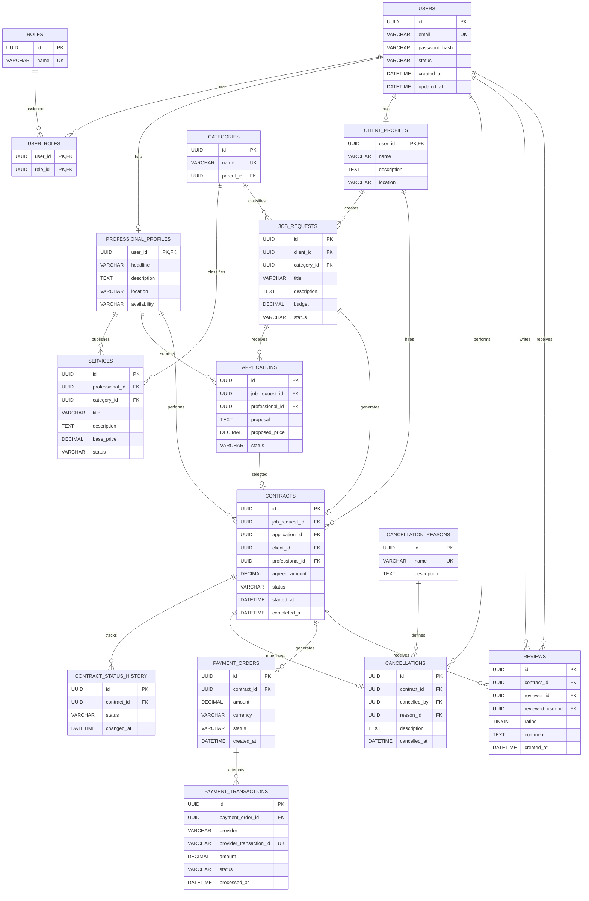

```mermaid
erDiagram

    USERS {
        UUID id PK
        VARCHAR email UK
        VARCHAR password_hash
        VARCHAR status
        DATETIME created_at
        DATETIME updated_at
    }

    ROLES {
        UUID id PK
        VARCHAR name UK
    }

    USER_ROLES {
        UUID user_id PK, FK
        UUID role_id PK, FK
    }

    PROFESSIONAL_PROFILES {
        UUID user_id PK, FK
        VARCHAR headline
        TEXT description
        VARCHAR location
        VARCHAR availability
    }

    CLIENT_PROFILES {
        UUID user_id PK, FK
        VARCHAR name
        TEXT description
        VARCHAR location
    }

    CATEGORIES {
        UUID id PK
        VARCHAR name UK
        UUID parent_id FK
    }

    SERVICES {
        UUID id PK
        UUID professional_id FK
        UUID category_id FK
        VARCHAR title
        TEXT description
        DECIMAL base_price
        VARCHAR status
    }

    JOB_REQUESTS {
        UUID id PK
        UUID client_id FK
        UUID category_id FK
        VARCHAR title
        TEXT description
        DECIMAL budget
        VARCHAR status
    }

    APPLICATIONS {
        UUID id PK
        UUID job_request_id FK
        UUID professional_id FK
        TEXT proposal
        DECIMAL proposed_price
        VARCHAR status
    }

    CONTRACTS {
        UUID id PK
        UUID job_request_id FK
        UUID application_id FK
        UUID client_id FK
        UUID professional_id FK
        DECIMAL agreed_amount
        VARCHAR status
        DATETIME started_at
        DATETIME completed_at
    }

    CONTRACT_STATUS_HISTORY {
        UUID id PK
        UUID contract_id FK
        VARCHAR status
        DATETIME changed_at
    }

    CANCELLATION_REASONS {
        UUID id PK
        VARCHAR name UK
        TEXT description
    }

    CANCELLATIONS {
        UUID id PK
        UUID contract_id FK
        UUID cancelled_by FK
        UUID reason_id FK
        TEXT description
        DATETIME cancelled_at
    }

    PAYMENT_ORDERS {
        UUID id PK
        UUID contract_id FK
        DECIMAL amount
        VARCHAR currency
        VARCHAR status
        DATETIME created_at
    }

    PAYMENT_TRANSACTIONS {
        UUID id PK
        UUID payment_order_id FK
        VARCHAR provider
        VARCHAR provider_transaction_id UK
        DECIMAL amount
        VARCHAR status
        DATETIME processed_at
    }

    REVIEWS {
        UUID id PK
        UUID contract_id FK
        UUID reviewer_id FK
        UUID reviewed_user_id FK
        TINYINT rating
        TEXT comment
        DATETIME created_at
    }

    USERS ||--o{ USER_ROLES : has
    ROLES ||--o{ USER_ROLES : assigned

    USERS ||--o| PROFESSIONAL_PROFILES : has
    USERS ||--o| CLIENT_PROFILES : has

    CATEGORIES ||--o{ SERVICES : classifies
    PROFESSIONAL_PROFILES ||--o{ SERVICES : publishes
    CATEGORIES ||--o{ JOB_REQUESTS : classifies
    CLIENT_PROFILES ||--o{ JOB_REQUESTS : creates

    JOB_REQUESTS ||--o{ APPLICATIONS : receives
    PROFESSIONAL_PROFILES ||--o{ APPLICATIONS : submits

    JOB_REQUESTS ||--o| CONTRACTS : generates
    APPLICATIONS ||--o| CONTRACTS : selected
    CLIENT_PROFILES ||--o{ CONTRACTS : hires
    PROFESSIONAL_PROFILES ||--o{ CONTRACTS : performs

    CONTRACTS ||--o{ CONTRACT_STATUS_HISTORY : tracks
    CONTRACTS ||--o| CANCELLATIONS : may_have
    CANCELLATION_REASONS ||--o{ CANCELLATIONS : defines
    USERS ||--o{ CANCELLATIONS : performs

    CONTRACTS ||--o{ PAYMENT_ORDERS : generates
    PAYMENT_ORDERS ||--o{ PAYMENT_TRANSACTIONS : attempts

    CONTRACTS ||--o{ REVIEWS : receives
    USERS ||--o{ REVIEWS : writes
    USERS ||--o{ REVIEWS : receives
```