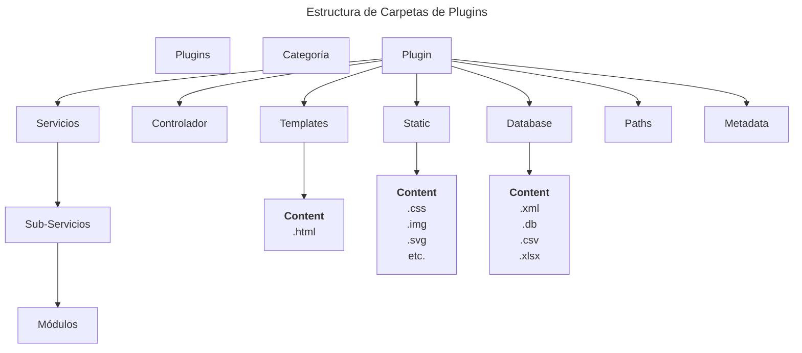
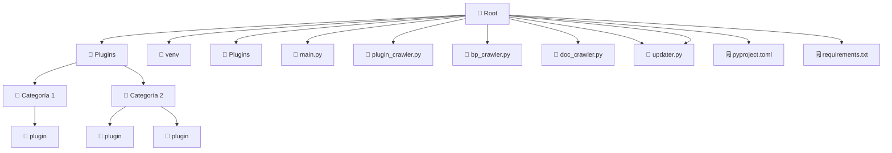

# Estructura del plugin
La estructura del plugin se compone por las siguientes **Entidades**:

- Automatizacion (Sub Servicio):
- Servicios
- Endpoints (Controlador)
- Worker (Trabajo en segundo plano)
- Base de datos (sqlite,excel,csv,etc)
- Templates (.html)
- Static (.css,svg,img)
- Exports (Cualquier archivo de prueba, resultado de tests, etc.)
- Metadatos
- Paths (Rutas dinámicas)
- Actualizador de Paths

# Filosofía de plugins
Los plugins se conforman de dos tipos de automatización:

- **Sub Servicio o Automatización Común**: Se encarga de obtener y retornar un resultado mediante un input como: Archivos(bytes o B64),diccionarios, Json, id. Puede ejecutar consultas a su base de datos y guardar datos. Puede tener acceso a módulos **Privados**.

* Privado significa que solo el subservicio puede acceder a sus módulos privados, ninguna entidad puede acceder a estos módulos.

- **Worker**: Son procesos en segundo plano que pueden ejecutar funciones. pueden ejecutar Sub Servicios y tienen acceso a base de datos,
se manejan mediante horarios configurados.

### Otras Entidades:

- **Servicios**: Los servicios son la puerta de entrada a los subservicios. mediante los servicios los endpoints pueden ejectuar funciones usando inputs. Los servicios tienen toda la lógica de negocio. Se pueden combinar resultados de sub servicios, puede acceder a base de datos, en este caso los servicios cumplen la función de ser modulos, por lo que no tendrán carpeta de módulos.

- **Controlador**: Reciben inputs y devuelven resultados. Los controladores se encargan de llamar funciones de los Servicios, por lo que sólo se deben utilizar para definir el tipo y la estructura del dato a devolver. Los controladores tambien pueden ser utilizados para renderizar páginas hechas con html.

- **Templates**: Renderizan la información de los endpoints. un endpoint puede renderizar los datos directamente o el mismo template puede consumir mediante javascript.

- **Static**: Archivos de estilo e imagenes que consumen los templates.

- **Exports**: Archivos de prueba. No debe usarse para guardar resultados a largo plazo.

# Estructura de Carpetas de Plugins

# Estructura General

# Gobernanza de datos 

La base de datos solamente puede contener datos funcionales, es decir: Los datos que consumirá y escribirá el plugin para su correcto funcionamiento. Los datos jamás deben contener información operacional u orientada a reportería.

En cuanto a los datos operacionales estos deben ser gestionados mediante conexiones a bases de datos externas y centralizadas. 